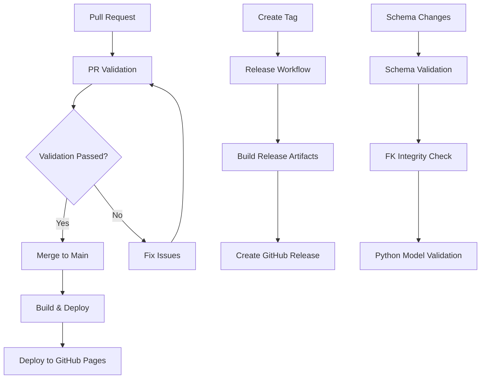

# 🚀 BOOST Documentation CI/CD Pipeline

This document describes the comprehensive CI/CD pipeline implementation for the BOOST Data Standard documentation build and deployment process.

## 📋 Overview

The CI/CD pipeline consists of **4 main workflows** designed to ensure documentation quality, automate builds, and deploy documentation across multiple environments:

1. **PR Validation** (`validate-pr.yml`) - Fast quality gates for pull requests
2. **Build & Deploy** (`build-deploy.yml`) - Full documentation build and deployment to staging  
3. **Release Management** (`release.yml`) - Tagged release builds with artifact creation
4. **Schema Validation** (`schema-validation.yml`) - Comprehensive schema integrity checks

## 🏗️ Workflow Architecture

## 🔍 Workflow Details

### 1. PR Validation (`validate-pr.yml`)

**Triggers:** Pull requests to `main` or `develop` branches
**Purpose:** Fast quality gates to prevent issues from entering main branch
**Duration:** ~3-5 minutes

**Quality Gates:**
- ✅ JSON Schema syntax validation for all 33+ entities
- ✅ Schema structure validation (required keys, proper format)
- ✅ Foreign key integrity checks
- ✅ Documentation build test
- ✅ HTML output validation

**Artifacts:** PR build artifacts (retained 7 days)

### 2. Build & Deploy (`build-deploy.yml`)

**Triggers:** Pushes to `main` branch, manual dispatch
**Purpose:** Full documentation build and deployment to production
**Duration:** ~8-12 minutes

**Build Process:**
1. **Environment Setup**: Python 3.11, LaTeX, Bikeshed
2. **Version Extraction**: From git tags (authoritative source)
3. **Schema Validation**: Comprehensive validation of all schemas
4. **Documentation Build**: HTML generation with ReSpec styling
5. **Build Validation**: Output validation and quality checks
6. **GitHub Pages Deployment**: Automated deployment to public documentation site

**Outputs:**
- 📚 Complete HTML documentation
- 🔍 Interactive ERD Navigator  
- 📋 All schema files
- 🌐 Deployed to GitHub Pages

### 3. Release Management (`release.yml`)

**Triggers:** Git tags matching `v[0-9]+.0.0` pattern (major versions only), manual dispatch
**Purpose:** Create production releases with downloadable artifacts for major versions
**Duration:** ~12-18 minutes

**Major Version Policy:** Only major versions (v1.0.0, v2.0.0, v3.0.0, etc.) trigger automatic releases.

**Release Process:**
1. **Comprehensive Validation**: Full schema and integrity validation
2. **Multi-format Build**: HTML + PDF documentation generation
3. **Release Package Creation**: Complete downloadable packages
4. **GitHub Release**: Automated release creation with artifacts

**Artifacts:**
- 📦 Complete release packages (ZIP, TAR.GZ)
- 📄 PDF documentation (when available)
- 📚 HTML documentation
- 🔍 ERD Navigator
- 📋 All schema files

### 4. Schema Validation (`schema-validation.yml`)

**Triggers:** Schema file changes, manual dispatch with validation levels
**Purpose:** Deep validation of schema integrity and relationships
**Duration:** ~5-8 minutes

### 5. Version Management (`version-check.yml`)

**Triggers:** All version tags (excluding major versions), manual version planning
**Purpose:** Analyze version tags and provide guidance for non-major versions
**Duration:** ~1-2 minutes

**Features:**
- Version type analysis (major/minor/patch)
- Release policy enforcement notifications
- Manual release guidance for non-major versions
- Version planning assistance

**Validation Matrix:**
- **Syntax Validation**: JSON format correctness
- **Structure Validation**: Required keys and schema structure
- **Metadata Validation**: BOOST metadata completeness
- **Pattern Validation**: Foreign key pattern consistency
- **Relationship Validation**: FK integrity across all entities
- **Python Model Validation**: Pydantic model compatibility

## 🔧 Technical Implementation

### Dependencies

**System Dependencies:**
- `bikeshed` - Document processing engine
- `Python 3.11` - For HTML manipulation and validation scripts
- `LaTeX` - PDF generation (optional)
- `pandoc` - HTML to PDF conversion fallback

**Python Dependencies:**
- `jsonschema` - JSON Schema validation
- `pydantic[email]>=2.0.0` - Python model validation
- `requests` - HTTP utilities

### Environment Variables

| Variable | Purpose | Example |
|----------|---------|---------|
| `BOOST_DOC_VERSION` | Current build version | `v2.9.0` |
| `GITHUB_TOKEN` | GitHub API access | Auto-provided |

### Caching Strategy

- **Python Dependencies**: pip cache for faster installs
- **System Packages**: apt cache for LaTeX and system tools
- **Bikeshed Data**: Bikeshed spec database cache

## 📊 Quality Gates & Validation

### Schema Validation Requirements

1. **JSON Syntax**: All schema files must be valid JSON
2. **Structure Compliance**: Required keys (`schema`, `boost_metadata`) must be present
3. **Metadata Completeness**: Entity name, primary key, area, description required
4. **Foreign Key Integrity**: All FK patterns must reference existing entities
5. **Pattern Consistency**: FK patterns must follow BOOST conventions

### Build Validation Requirements

1. **HTML Generation**: `boost-spec.html` must be generated successfully
2. **File Size**: HTML output must be substantial (>200KB for releases)
3. **Content Validation**: Must contain expected BOOST content
4. **Styling Application**: ReSpec CSS must be applied correctly
5. **ERD Navigator**: Interactive tool must be present and functional

## 🚀 Deployment Strategy

### GitHub Pages Deployment

**URL Structure:**
- Main Documentation: `https://[username].github.io/[repo]/boost-spec.html`
- ERD Navigator: `https://[username].github.io/[repo]/erd-navigator/`
- Schema Files: `https://[username].github.io/[repo]/schema/`

**Deployment Process:**
1. Build artifacts are packaged for Pages
2. Automatic index.html redirect to main documentation
3. Version information embedded in deployment
4. All supporting files (CSS, schemas, ERD) included

### Release Artifacts

**Package Contents:**
- Complete HTML documentation with interactive features
- PDF documentation (when available)
- Interactive ERD Navigator
- All JSON schema validation files
- Python reference implementation
- Supporting files (CSS, includes, etc.)
- Comprehensive README with usage instructions

## 🔄 Workflow Triggers & Conditions

### Automatic Triggers

| Trigger | Workflows | Purpose |
|---------|-----------|---------|
| PR to main/develop | `validate-pr.yml` | Quality gates |
| Push to main | `build-deploy.yml`, `schema-validation.yml` | Deploy latest |
| Tag push `v[0-9]+.0.0` | `release.yml` | Create major releases |
| Tag push `v*.*.*` (non-major) | `version-check.yml` | Version analysis |
| Schema file changes | `schema-validation.yml` | Validate changes |

### Manual Triggers

All workflows support manual dispatch via GitHub Actions UI with configurable parameters.

## 🏷️ **Version Release Policy**

### **Major Version Releases (Automatic)**
- **Pattern:** `v[0-9]+.0.0` (e.g., v1.0.0, v2.0.0, v3.0.0)
- **Trigger:** Automatic release workflow
- **Includes:** Full documentation, PDF, artifacts, GitHub release
- **Use for:** Breaking changes, major new features, significant updates

### **Minor/Patch Version Releases (Manual)**  
- **Pattern:** `v*.*.*` (e.g., v2.1.0, v2.1.1)
- **Trigger:** Version analysis workflow only
- **Default:** No automatic release created
- **Manual Options:**
  1. Use manual dispatch in Release workflow with `force_release=true`
  2. Wait and accumulate changes for next major version

### **Version Policy Summary**

| Version Type | Pattern | Auto Release | Manual Release | Use Case |
|--------------|---------|--------------|----------------|----------|
| **Major** | `v1.0.0` | ✅ Yes | ✅ Yes | Breaking changes, major features |
| **Minor** | `v1.1.0` | ❌ No | ✅ Yes (forced) | New features, backwards compatible |
| **Patch** | `v1.1.1` | ❌ No | ✅ Yes (forced) | Bug fixes, small improvements |

## 📈 Performance Optimizations

1. **Parallel Validation**: Schema validation runs in parallel matrix
2. **Conditional Builds**: Only run when relevant files change
3. **Artifact Caching**: Dependencies cached between runs  
4. **Incremental Validation**: Only validate changed schemas when possible
5. **Concurrent Jobs**: Multiple validation types run simultaneously

## 🛡️ Security Considerations

1. **Permissions**: Minimal required permissions for each workflow
2. **Token Usage**: GitHub tokens automatically scoped and rotated
3. **Artifact Retention**: Appropriate retention policies (7-90 days)
4. **Environment Protection**: Production deployments require approval
5. **Dependency Security**: Regular dependency updates via Dependabot

## 📚 Usage Instructions

### For Contributors

1. **Making Changes**: Create feature branches, submit PRs
2. **Schema Changes**: Ensure FK patterns follow BOOST conventions  
3. **Testing**: PR validation provides immediate feedback
4. **Documentation**: Changes automatically deployed after merge

### For Maintainers

1. **Creating Releases**: Push tags matching `v*.*.*` pattern
2. **Manual Builds**: Use workflow dispatch for custom builds
3. **Quality Control**: Review PR validation results before merge
4. **Monitoring**: Check GitHub Actions tab for build status

### For Integrators

1. **Schema Access**: Download from releases or access via GitHub Pages
2. **Python Models**: Use reference implementation from releases
3. **API Integration**: Access schemas via predictable URLs
4. **Version Tracking**: Monitor releases for updates

## 🔧 Troubleshooting

### Common Issues

**Build Failures:**
- Check bikeshed installation and update
- Verify all schema files have valid JSON syntax
- Ensure git tags are properly formatted

**Deployment Issues:**
- Verify GitHub Pages is enabled in repository settings
- Check workflow permissions for Pages deployment
- Ensure artifacts are correctly packaged

**Schema Validation Failures:**
- Validate JSON syntax in changed schemas
- Check FK patterns match expected prefixes
- Ensure all referenced entities exist

### Monitoring & Alerts

1. **GitHub Actions**: Built-in status monitoring
2. **Pages Deployment**: Automatic deployment status
3. **Release Creation**: GitHub notifications for new releases
4. **PR Checks**: Automatic status checks on pull requests

## 🎯 Future Enhancements

1. **PDF Generation**: Enhanced LaTeX-based PDF generation
2. **Multi-format Output**: Additional output formats (Word, etc.)
3. **Performance Testing**: Automated performance validation
4. **Link Validation**: Comprehensive link checking
5. **Accessibility**: Automated accessibility testing
6. **Internationalization**: Multi-language documentation support

## 📞 Support & Maintenance

**Workflow Maintenance:**
- Regular dependency updates
- GitHub Actions version updates  
- Performance optimization reviews
- Security audit and updates

**Documentation Maintenance:**
- Keep this guide updated with changes
- Document new quality gates or validation rules
- Update troubleshooting guides based on issues

For questions or issues with the CI/CD pipeline, please:
1. Check the GitHub Actions logs for detailed error information
2. Review this documentation for troubleshooting steps
3. Open an issue in the repository for pipeline-related problems