# BOOST ERD Styling Guide

## Enhanced Visual Design for BOOST Entity Relationship Diagram

This guide explains the visual enhancements made to the BOOST ERD to improve readability, comprehension, and professional presentation.

## 🎨 Visual Enhancements Applied

### 1. **Entity Clustering by Function**
Entities are organized into logical clusters:
- 🏢 **Core Organization & Certification** (blue theme)
- 🌿 **Supply Chain & Materials** (green theme)  
- 💱 **Transaction & Batch Processing** (orange theme)
- 🏆 **Claims & Verification** (purple theme)
- ⚡ **Carbon & Energy Data** (teal theme)
- ⚖️ **Mass Balance & Product Tracking** (amber theme)
- 🛣️ **LCFS-Specific Entities** (indigo theme)

### 2. **Emoji-Enhanced Attribute Descriptions**
Each attribute now includes contextual emojis and descriptions:
- 🆔 Identifiers and keys
- 📛 Names and labels
- 📍 Locations and addresses
- 📅 Dates and timing
- 📊 Measurements and quantities
- 🔄 Status and workflow indicators
- 🌐 URLs and external references

### 3. **Enhanced Relationship Labels**
Relationships now include emoji annotations:
- `🏢 holds 📜` (Organization holds Certificate)
- `💱 uses pathway 🛣️` (Transaction uses LCFSPathway)
- `📦 verified by ✅` (TransactionBatch verified by VerificationStatement)

### 4. **Color-Coded Entity Groups**

```mermaid
graph LR
    subgraph "Entity Color Themes"
        ORG[Organization<br/>🔵 Blue Theme]
        MAT[Material<br/>🟢 Green Theme]
        TXN[Transaction<br/>🟠 Orange Theme]
        CLM[Claims<br/>🟣 Purple Theme]
        ENG[Energy Data<br/>🔹 Teal Theme]
        BAL[Mass Balance<br/>🟡 Amber Theme]
        LCFS[LCFS Entities<br/>🟦 Indigo Theme]
    end
    
    style ORG fill:#e3f2fd,stroke:#1976d2,stroke-width:3px
    style MAT fill:#e8f5e8,stroke:#388e3c,stroke-width:3px
    style TXN fill:#fff3e0,stroke:#f57c00,stroke-width:3px
    style CLM fill:#f3e5f5,stroke:#7b1fa2,stroke-width:3px
    style ENG fill:#e0f2f1,stroke:#00695c,stroke-width:3px
    style BAL fill:#fff8e1,stroke:#f57f17,stroke-width:3px
    style LCFS fill:#e8eaf6,stroke:#3f51b5,stroke-width:3px
```



### 5. **Improved Typography & Hierarchy**
- **Primary Keys**: 🆔 Clear identification with PK marker
- **Foreign Keys**: 🔗 FK relationships clearly marked
- **Attribute Types**: 📊 Type information with descriptions
- **Entity Names**: 📛 Clear, descriptive entity names

## 🛠️ Technical Implementation

### Mermaid Styling Features Used:
1. **Custom Theme Variables**: Color palette customization
2. **Entity Clustering**: Logical grouping with visual separation
3. **Enhanced Annotations**: Emoji-rich descriptions and comments
4. **Relationship Enhancement**: Descriptive relationship labels
5. **Responsive Design**: Scalable for different viewing contexts

### Color Palette:
```css
Primary Colors:
- Organization: #e3f2fd (Light Blue)
- Materials: #e8f5e8 (Light Green)
- Transactions: #fff3e0 (Light Orange)
- Claims: #f3e5f5 (Light Purple)
- Energy: #e0f2f1 (Light Teal)
- Mass Balance: #fff8e1 (Light Amber)
- LCFS: #e8eaf6 (Light Indigo)

Border Colors:
- Primary: #1976d2 (Blue)
- Success: #388e3c (Green)
- Warning: #f57c00 (Orange)
- Info: #7b1fa2 (Purple)
```

## 📈 Benefits of Enhanced Styling

### 1. **Improved Comprehension**
- Visual clustering reduces cognitive load
- Emoji annotations provide instant context
- Color coding helps identify entity types quickly

### 2. **Professional Presentation**
- Clean, modern visual design
- Consistent styling throughout
- Publication-ready quality

### 3. **Enhanced Navigation**
- Logical entity grouping
- Clear relationship paths
- Intuitive visual flow

### 4. **Accessibility**
- High contrast color combinations
- Clear typography hierarchy
- Scalable design elements

## 🔄 Usage Instructions

### For Development:
1. Use `boost_erd_enhanced.mermaid` for presentations and documentation
2. Maintain `boost_erd.mermaid` as the canonical technical reference
3. Update both files when adding new entities

### For Documentation:
1. Include entity cluster descriptions in documentation
2. Reference emoji legend for attribute meanings
3. Use color coding to explain entity relationships

### For Presentations:
1. Export as SVG for scalable graphics
2. Use entity clusters to organize discussion topics
3. Leverage color themes to highlight specific workflows

## 🎯 Future Enhancements

### Planned Improvements:
1. **Interactive Features**: Clickable entity details
2. **Dynamic Filtering**: Show/hide entity groups
3. **Zoom Functionality**: Detail levels for different audiences
4. **Animation**: Flow visualization for process understanding
5. **Theme Variants**: Light/dark mode support

This enhanced ERD provides a much more engaging and professional visual representation of the BOOST data standard while maintaining all technical accuracy and completeness.