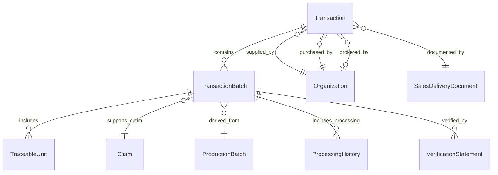

# Transaction and TransactionBatch Design Framework

## Overview

The BOOST data standard implements a clear separation between business-level transactions and physical material batches to eliminate overlap, reduce complexity, and provide precise tracking of both commercial and physical aspects of biomass supply chain operations. This framework resolves the historical confusion between these two critical but distinct concepts.

## Design Philosophy

### Core Principle: Business vs. Physical Separation

The framework recognizes that biomass supply chains involve two fundamentally different types of activities:

1. **Business Transactions** - Commercial agreements, contracts, and financial arrangements
2. **Physical Material Movements** - Actual biomass handling, processing, and delivery

These activities have different lifecycles, stakeholders, and data requirements, necessitating separate but related entities.

## Entity Definitions

### Transaction (Business Contract Level)

**Purpose**: Represents the commercial agreement between organizations for the sale and purchase of biomass materials.

**Scope**: Business metadata, contractual terms, financial arrangements, and legal documentation.

**Lifecycle**: From initial contract negotiation through final payment and closure.

**Key Characteristics**:
- ✅ **Commercial Focus** - Contract value, payment terms, delivery conditions
- ✅ **Organization Relationships** - Buyer, seller, broker relationships  
- ✅ **Legal Documentation** - Sales documents, compliance requirements
- ✅ **High-Level Status** - Contract execution and completion tracking
- ✅ **Geographic Scope** - Primary transaction locations and jurisdictions

**Field Structure**:
```json
{
  "transactionId": "TXN-PACIFIC-KLAMATH-2025-042",
  "supplyingOrganizationId": "ORG-KLAMATH-HARVEST-001",
  "customerOrganizationId": "ORG-PACIFIC-MILL-001", 
  "transactionDate": "2025-07-15",
  "contractValue": 125000.00,
  "contractCurrency": "USD",
  "contractTerms": "FOB mill entrance",
  "paymentTerms": "Net 30 days",
  "transactionStatus": "confirmed",
  "salesDocumentId": "INVOICE-KLA-042-2025",
  "expectedDeliveryDate": "2025-07-20",
  "complianceRequirements": ["FSC Chain of Custody", "SBP DTS Registration"]
}
```

### TransactionBatch (Physical Material Level)

**Purpose**: Represents specific quantities of physical biomass materials with detailed characteristics, traceability, and quality attributes.

**Scope**: Material properties, traceability data, processing history, quality metrics, and sustainability claims.

**Lifecycle**: From material preparation through delivery acceptance and reconciliation.

**Key Characteristics**:
- ✅ **Physical Focus** - Quantities, species, quality, plant parts
- ✅ **Traceability Integration** - TRUs, processing history, location tracking
- ✅ **Quality Management** - Grades, measurements, assessments
- ✅ **Sustainability Claims** - Certifications, compliance validation
- ✅ **Processing Chain** - Complete transformation and movement history

**Field Structure**:
```json
{
  "transactionBatchId": "TXB-KLA-042-001",
  "transactionId": "TXN-PACIFIC-KLAMATH-2025-042",
  "quantity": 84.5,
  "quantityUnit": "cubic_meters", 
  "traceableUnitIds": ["TRU-LOG-CA-042", "TRU-PILE-DF-043"],
  "speciesComposition": ["Douglas Fir: 60%", "Ponderosa Pine: 40%"],
  "qualityGrade": "Grade A Sawlog",
  "claimId": "CLAIM-FSC-MIX-042",
  "processingHistoryIds": ["PROC-HIST-001", "PROC-HIST-002"],
  "reconciliationStatus": "resolved",
  "batchStatus": "delivered",
  "deliveryDate": "2025-07-16T08:00:00Z"
}
```

## Relationship Model

### One-to-Many Structure

**Single Business Transaction → Multiple Physical Batches**

This relationship supports common business scenarios:

1. **Phased Delivery**: One contract delivered in multiple shipments
2. **Quality Segregation**: Different grades delivered under same contract
3. **Species Separation**: Mixed species contracts with separate batch handling
4. **Timing Flexibility**: Contract signed before all material is ready

**Example Business Case**:
```
Transaction: "1,000 cubic meters mixed species sawlogs - $125,000"
├── TransactionBatch 1: 400 m³ Douglas Fir Grade A ($50,000 value)
├── TransactionBatch 2: 350 m³ Douglas Fir Grade B ($35,000 value)  
├── TransactionBatch 3: 150 m³ Ponderosa Pine Grade A ($25,000 value)
└── TransactionBatch 4: 100 m³ Mixed Pulpwood ($15,000 value)
```

### Entity Relationships



## Data Responsibilities

### Transaction Entity Responsibilities

**Business and Legal**:
- ✅ Contract negotiation and execution details
- ✅ Financial terms, pricing, and payment conditions  
- ✅ Delivery terms and commercial risk allocation
- ✅ Legal compliance and regulatory requirements
- ✅ Inter-organizational relationship management

**Geographic and Temporal**:
- ✅ Primary transaction jurisdiction and applicable law
- ✅ Contract timeline and delivery expectations
- ✅ High-level geographic scope of operations

**Status Management**:
- ✅ Commercial transaction status (pending, confirmed, completed)
- ✅ Contract amendment and modification tracking
- ✅ Payment and settlement status

### TransactionBatch Entity Responsibilities

**Material Properties**:
- ✅ Physical quantities, units, and measurements
- ✅ Species composition and botanical characteristics
- ✅ Quality grades, assessments, and metrics
- ✅ Plant part composition and categorization

**Traceability and Processing**:
- ✅ TraceableUnit references and genealogy
- ✅ Complete processing history and transformations
- ✅ Location tracking and movement documentation
- ✅ Equipment and operator accountability

**Quality and Compliance**:
- ✅ Sustainability claims and certifications
- ✅ Quality control measurements and validations
- ✅ Regulatory compliance verification
- ✅ Third-party verification statements

**Supply Chain Operations**:
- ✅ Material preparation and batch creation
- ✅ Transportation and delivery coordination
- ✅ Reconciliation and acceptance procedures
- ✅ Media break detection and resolution

## Business Logic Rules

### Transaction-Level Rules

1. **Contract Integrity**: Transaction value must equal sum of associated TransactionBatch values
2. **Organization Validation**: Supplying and customer organizations must have valid certificates
3. **Temporal Consistency**: Contract signed date ≤ transaction date ≤ expected delivery date  
4. **Status Progression**: Transaction status must follow logical progression (pending → confirmed → delivered → completed)
5. **Geographic Consistency**: Transaction location must align with organizational jurisdictions

### TransactionBatch-Level Rules

1. **Quantity Conservation**: Batch quantity must equal sum of associated TraceableUnit volumes
2. **Quality Consistency**: Quality grade must align with included TRU quality assessments
3. **Claim Validation**: Sustainability claims must be valid for all included TRUs
4. **Species Accuracy**: Species composition must match TRU species components
5. **Processing Chain Integrity**: Processing history must form complete, valid chain

### Cross-Entity Rules

1. **Batch Completeness**: All TransactionBatches for a Transaction must be delivered before Transaction completion
2. **Value Allocation**: Sum of TransactionBatch implied values must equal Transaction contract value
3. **Timeline Alignment**: TransactionBatch delivery dates must fall within Transaction expected delivery range
4. **Compliance Consistency**: TransactionBatch compliance status must support Transaction compliance requirements

## Usage Patterns

### Business Process Integration

**Sales and Procurement**:
```sql
-- Find all active contracts for an organization
SELECT * FROM Transaction 
WHERE supplyingOrganizationId = 'ORG-001' 
AND transactionStatus IN ('pending', 'confirmed');

-- Calculate contract completion percentage
SELECT t.transactionId, 
       COUNT(tb.transactionBatchId) as total_batches,
       SUM(CASE WHEN tb.batchStatus = 'delivered' THEN 1 ELSE 0 END) as delivered_batches
FROM Transaction t
LEFT JOIN TransactionBatch tb ON t.transactionId = tb.transactionId
GROUP BY t.transactionId;
```

**Operations and Logistics**:
```sql
-- Track material preparation status
SELECT tb.*, t.expectedDeliveryDate
FROM TransactionBatch tb
JOIN Transaction t ON tb.transactionId = t.transactionId
WHERE tb.batchStatus = 'prepared'
AND t.expectedDeliveryDate <= CURRENT_DATE + INTERVAL '7 days';

-- Monitor traceability completeness
SELECT tb.transactionBatchId, 
       CASE WHEN tb.mediaBreakDetected THEN 'ATTENTION REQUIRED' ELSE 'OK' END
FROM TransactionBatch tb
WHERE tb.reconciliationStatus = 'pending';
```

### Analytics and Reporting

**Financial Performance**:
```sql
-- Revenue by customer and time period
SELECT customerOrganizationId, 
       DATE_TRUNC('month', transactionDate) as month,
       SUM(contractValue) as total_revenue
FROM Transaction
WHERE transactionStatus = 'completed'
GROUP BY customerOrganizationId, month;
```

**Quality Analysis**:
```sql
-- Quality grade distribution across batches
SELECT qualityGrade, 
       COUNT(*) as batch_count,
       SUM(quantity) as total_volume
FROM TransactionBatch
GROUP BY qualityGrade;
```

## Integration with BOOST Traceability System

### Media-Interruption-Free Traceability

The separated model enhances BOOST traceability system compliance:

**Transaction Level**:
- Commercial agreements maintain business continuity
- Contract terms specify traceability requirements
- Compliance requirements enforce media-break prevention

**TransactionBatch Level**:
- Direct integration with TraceableUnit genealogy
- ProcessingHistory references maintain complete audit trails
- Media break detection flags enable immediate response

### Three Critical Tracking Points

**Tracking Point Integration**:
1. **Harvest Site** - TRUs created and assigned to future TransactionBatches
2. **Forest Road/Transport** - TransactionBatch preparation and quality verification
3. **Mill Entrance** - TransactionBatch delivery and reconciliation

### Volume Conservation and Reconciliation

**Multi-Level Validation**:
- Transaction-level volume commitments vs. actual deliveries
- TransactionBatch-level quantity vs. constituent TRU volumes
- ProcessingHistory-level volume conservation through transformations

## Migration from Legacy Model

### Data Transformation Strategy

**Transaction Entity Migration**:
1. **Preserve Business Fields**: Contract value, payment terms, organization relationships
2. **Remove Physical Fields**: Species composition, TRU references, processing data
3. **Add Financial Fields**: Currency, detailed terms, broker relationships
4. **Enhance Status Tracking**: More granular commercial status values

**TransactionBatch Entity Migration**:
1. **Enhance Physical Fields**: Quality metrics, plant part composition
2. **Add Traceability Fields**: Processing history references, media break detection
3. **Improve Status Tracking**: Detailed batch lifecycle status
4. **Strengthen Validation**: Reconciliation status, measurement references

### Backward Compatibility

**API Compatibility Layer**:
```typescript
// Legacy API call
GET /transactions/{id}/materials
// Maps to new structure:
// GET /transactions/{id}/batches → TransactionBatch entities

// Legacy combined view
interface LegacyTransactionView {
  transactionId: string;
  // Business fields from Transaction
  contractValue: number;
  // Physical fields aggregated from TransactionBatches
  totalQuantity: number;
  speciesBreakdown: string[];
}
```

## Benefits of Separated Model

### Clarity and Maintainability

1. **Clear Responsibilities**: No overlap between business and physical concerns
2. **Simplified Validation**: Entity-specific business rules without conflicts
3. **Enhanced Querying**: Targeted queries for business vs. operational needs
4. **Better Performance**: Optimized indexes and query patterns

### Scalability and Flexibility

1. **Independent Scaling**: Business and physical data can scale independently
2. **Workflow Flexibility**: Business contracts can proceed before material readiness
3. **Reporting Granularity**: Business and operational reports with appropriate detail
4. **System Integration**: Clean boundaries for ERP and MES system integration

### Regulatory Compliance

1. **Audit Trails**: Clear separation of financial and physical audit requirements
2. **Claim Management**: Sustainability claims properly associated with physical material
3. **Traceability Integrity**: Complete physical traceability without business data contamination
4. **Documentation Clarity**: Legal documents map cleanly to appropriate entity level

## Conclusion

The separated Transaction/TransactionBatch model provides a robust foundation for managing the complex interplay between business and physical aspects of biomass supply chains. By eliminating overlap and clearly defining responsibilities, this approach supports both operational efficiency and regulatory compliance while maintaining the flexibility needed for diverse business models and supply chain configurations.

This design directly supports the BOOST traceability system's media-interruption-free traceability requirements while providing the business transaction management capabilities needed for commercial biomass operations.