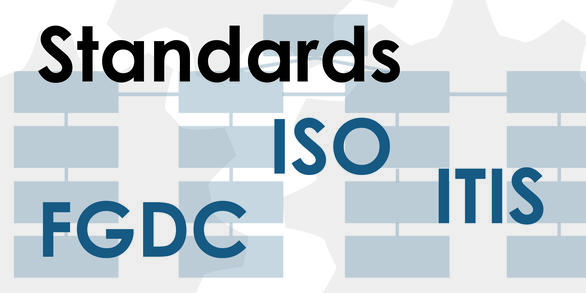

# BOOST Agency Engagement: CalRecycle

---

## Outline

- BOOST Overview (10-15 minutes)
- Review BOOST Entity-Relationship Diagram (20-30 minutes)
    - *DISCUSSION:* Are we missing entities?
    - Specific entities *DISCUSSION*:
        - Do we have the right attributes? 
        - What are we missing?
- CalRecycle Topics
    - "biomass conversion" vs "transformation", SB 498 Reporting, SB 1383, Recycling and Disposal Reporting System (RDRS)

Note: 
- We are hosting targeted meetings with CA agencies to ensure we understand need 
- Version 0.1 will be released in Q2 of 2025.

---

--

## What BOOST is

- A specification defining data formats, field definitions, and validation rules
- A common vocabulary enabling consistent interpretation of biomass chain-of-custody information
- A framework establishing relationships between different types of information
- A validation mechanism ensuring data quality and consistency

--

## What BOOST Is Not

- **Not Software**: BOOST does not prescribe specific applications, databases, or user interfaces. 
- **Not a Database**: BOOST does not create centralized storage or control where data resides. 
- **Not Dashboards or Analytics**: BOOST does not define how data should be visualized or analyzed. 
- **Not a Certification Scheme**: BOOST does not establish sustainability criteria or certification requirements. 

Note: 
- **Not Software** Organizations remain free to choose their preferred software platforms while adhering to BOOST data exchange requirements. 
- **Not Database** Each organization maintains control over their data while following standard formats for sharing.
- **Not Dashboards or Analytics**: It provides the foundation that enables various analytical tools to work with standardized data.
- **Not a Certification Scheme**: It provides the structure for documenting compliance with existing schemes.

--

## What is the objective?

*To develop and maintain a robust interoperable data standard for solid biomass comprised of schemas, protocols, and documenation for tracking biomass materials from source to end-use*

--

## WHAT are the goals

*To improve transparency, verification and trust in biomass supply chains*

*Reduce operational costs and increase access to markets for biomass producers and consumers*

--

## Who is involved?

- Anyone!
- stakeholders:
  - NGOs, independent certification bodies 
  - fed/state agencies, 
  - small and large businesses
  - independent technical experts
  - software developers

---
## Data Standards ??

--
## What are Data Standards?

*Data standards are agreed-upon approaches that allow for consistent measurement, qualification, or exchange of information*

--

## Why develop a Data Standard

Provides a structured framework and a common language for:

- organizing, 
- documenting, 
- formatting **data**
  
Facilitating **aggregation**, **sharing**, and **reuse** across different systems and organizations

--

## What is Chain of Custody (CoC)?

Documentation and recording of:
- movement, 
- handling, 
- transformation 

of material through a supply chain

--

## How do Data Standards Support CoC?

For CoC software, data standards:
  - provide a data framework (entities, attributes, and relationships)
  - provide logic for tracking across complex processes and organizational boundaries
  - enable interoperability between systems
  - provide validation rules

---

## OPEN Standards

 
<em>Source: The Open Data Institute</em>

--

## Benefits of Openness

- encourages **interoperability** and digital integration across the supply chain
- transparency and trust among stakeholders in complex supply chains
- democratizes chain of custody data
- software differentiates on performance not on customer coersion

Note:
+ proprietary data formats
+ complex integration
+ data migration obstacles
+ lack of portability

---

## Core Components of the CoC Data Standard

*DRAFT* [Entity Relationship Diagram](https://carbondirect.github.io/BOOST/erd-navigator/)

**Framing Questions**

+ *Did we get the right set of entities?*
+ *Did we get the right attributes for entities you care about?*
+ *Are the relationships between entities appropriate?*

---

## "conversion" vs "transformation" 

- what process attributes?
- what biomass attributes?

--

## SB 498 Reporting

- What biomass attributes?
- Overlap with other programs?

--

## SB 1383

- Any differing defnitions from SB 498 reporting?
- Other considerations?

--

## Recycling and Disposal Reporting System (RDRS)

- Brief overview?
- Schema/documentation?
