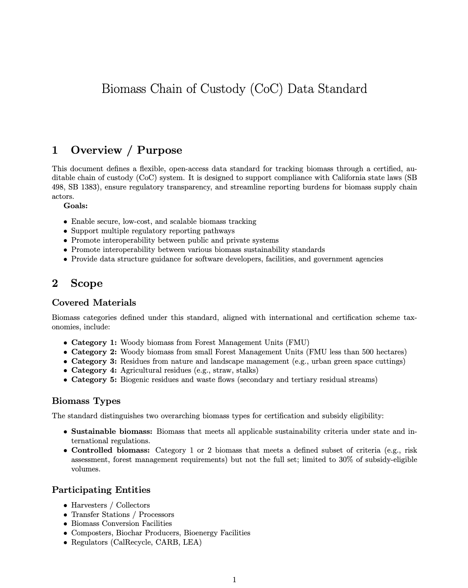
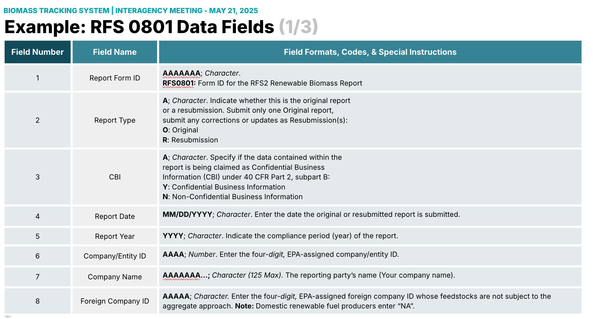

# Biomass Open Origin Standard for Tracking (BOOST)

---

## Outline

- Introducing the BOOST Community Group
- Data Standards: The Foundation for Biomass Chain of Custody
- The Importance of an "Open" Standard
- Relevance of W3C Community Groups

---


--

## What is BOOST?

- W3C Community Group 
- v0.1 funded by California Department of Conservation

--

## What is the objective?

*To develop and maintain a robust interoperable data standard for solid biomass comprised of schemas, protocols, and documenation for tracking biomass materials from source to end-use*

--

## WHAT are the goals

*To improve transparency, verification and trust in biomass supply chains*

*Reduce operational costs and increase access to markets for biomass producers and consumers*

--

## Who is involved?

- Anyone!
- stakeholders:
  - NGOs, independent certification bodies 
  - fed/state agencies, 
  - small and large businesses
  - independent technical experts

---
## Data Standards ??


--
## What are Data Standards?

*Data standards are agreed-upon approaches that allow for consistent measurement, qualification, or exchange of information*

--

## Why develop a Data Standard

Provides a structured framework and a common language for:

- organizing, 
- documenting, 
- formatting **data**
  
Facilitating **aggregation**, **sharing**, and **reuse** across different systems and organizations

--

## What is Chain of Custody (CoC)?

Documentation and recording of:
- movement, 
- handling, 
- transformation 

of material through a supply chain


--

## How do Data Standards Support CoC?

For CoC software, data standards:
  - provide a data framework (entities, attributes, and relationships)
  - provide logic for tracking across complex processes and organizational boundaries
  - enable interoperability between systems
  - provide validation rules

Note: This is a note

---

## OPEN Standards


<br>
<em>Source: The Open Data Institute</em>

--

## Benefits of Openness

- encourages **interoperability** and digital integration across the supply chain
- transparency and trust among stakeholders in complex supply chains
- democratizes chain of custody data
- software differentiates on performance not on customer coersion

Note:
+ proprietary data formats
+ complex integration
+ data migration obstacles
+ lack of portability

--

## Open Process in Practice

- W3C Community Groups are open to all
- Technical work in the BOOST group is conducted in public, utilizing:
  - Public mail lists 
  - GitHub repositories
  - Google Docs when necessary
- Ensures contributions and decisions are transparently tracked
- Participation does not require W3C CLA but  **we highly encourage it!**


Note:
+ joining the BOOST community group will ensure you are following the development
+ without a membership fee requirement
+ in the spirit of open collaboration

---

## Core Components of the CoC Data Standard

*DRAFT*

--

## 🔹 Module 1: Material Identity and Specification

- Key Fields: `productType`, `biomassClass`, `moistureContent`, `ashContent`, `netCalorificValue`, `originSpecies`
- Purpose: Standardize classification of the biomass according to ISO 17225 or other relevant systems.
- Data Sources: Lab analysis, supplier declarations, product certification documents.

--

## `material-spec.schema.json`
```json
{
  "$id": "https://example.org/schemas/material-spec.schema.json",
  "$schema": "http://json-schema.org/draft-07/schema#",
  "title": "Material Specification",
  "type": "object",
  "properties": {
    "biomassClass": {
      "type": "string",
      "description": "Classification according to ISO 17225 (e.g. ISO 17225-2: A1)"
    },
    "moistureContent": {
      "type": "number",
      "minimum": 0,
      "maximum": 100,
      "description": "Moisture content as a percentage"
    },
    "ashContent": {
      "type": "number",
      "minimum": 0,
      "maximum": 100,
      "description": "Ash content as a percentage"
    },
    "netCalorificValue": {
      "type": "number",
      "description": "Net calorific value in MJ/kg"
    },
    "originSpecies": {
      "type": "string",
      "description": "Botanical species name (e.g., Pinus radiata)"
    }
  },
  "required": ["biomassClass", "moistureContent"]
}
```

--

## 🔹 Module 2: Chain of Custody Events (EPCIS-style)
- Key Fields: `eventType`, `action`, `bizStep`, `disposition`, `eventTime`, `readLocation`
- Purpose: Record each event in the biomass lifecycle—e.g., harvested, processed, stored, shipped.
- Data Sources: ERP systems, inventory management, IoT sensors, shipping records.

Note: 
EPCIS: Electronic Product Code Information Services, is a global standard, defined by GS1, for capturing, sharing, and tracking event data about products and other assets in a supply chain

--

## `event.schema.json`

``` json
{
  "$id": "https://example.org/schemas/event.schema.json",
  "$schema": "http://json-schema.org/draft-07/schema#",
  "title": "Chain of Custody Event",
  "type": "object",
  "properties": {
    "eventTime": { "type": "string", "format": "date-time" },
    "eventType": { "type": "string", "enum": ["ObjectEvent"] },
    "action": { "type": "string", "enum": ["OBSERVE", "ADD", "DELETE"] },
    "bizStep": { "type": "string" },
    "disposition": { "type": "string" },
    "readPoint": {
      "type": "object",
      "properties": {
        "lat": { "type": "number" },
        "long": { "type": "number" },
        "locationName": { "type": "string" }
      },
      "required": ["lat", "long"]
    }
  },
  "required": ["eventTime", "eventType", "action", "readPoint"]
}
```

-- 

## 🔹 Module 3: Organizations & Roles
- Key Fields: `sender`, `receiver`, `processor`, `certifier`
- Purpose: Identify the parties involved in each supply chain step.
- Data Sources: Contracts, business records, certification platforms.


--

## `organization.schema.json`

```json
{
  "$id": "https://example.org/schemas/organization.schema.json",
  "$schema": "http://json-schema.org/draft-07/schema#",
  "title": "Organization",
  "type": "object",
  "properties": {
    "name": { "type": "string" },
    "role": { "type": "string" },
    "address": {
      "type": "object",
      "properties": {
        "locality": { "type": "string" },
        "region": { "type": "string" },
        "country": { "type": "string" }
      }
    }
  },
  "required": ["name"]
}
```

--
## 🔹 Module 4: Verification & Certification
- Key Fields: `certifiedBy`, `certificateID`, `validUntil`
- Purpose: Attach sustainability or compliance documentation.
- Data Sources: Certification body APIs or portals (e.g., SBP, RSB, FSC).

--

## `verification.schema.json`

```json
{
  "$id": "https://example.org/schemas/verification.schema.json",
  "$schema": "http://json-schema.org/draft-07/schema#",
  "title": "Verification Details",
  "type": "object",
  "properties": {
    "certifiedBy": { "type": "string" },
    "certificateID": { "type": "string" },
    "validUntil": { "type": "string", "format": "date" }
  },
  "required": ["certifiedBy", "certificateID"]
}
```

--

## 🔹 Module 5: Transport & Logistics
- Key Fields: `shipmentID`, `carrier`, `departure`, `arrival`, `route`, `vehicleType`
- Purpose: Track movement of biomass and support emissions accounting.
- Data Sources: Transport documents, customs declarations, GPS systems.

--

## `shipment.schema.json`
```json
{
  "$id": "https://example.org/schemas/shipment.schema.json",
  "$schema": "http://json-schema.org/draft-07/schema#",
  "title": "Biomass Shipment",
  "type": "object",
  "properties": {
    "shipmentID": { "type": "string" },
    "productType": { "type": "string" },
    "materialSpec": { "$ref": "material-spec.schema.json" },
    "event": { "$ref": "event.schema.json" },
    "sender": { "$ref": "organization.schema.json" },
    "receiver": { "$ref": "organization.schema.json" },
    "verification": { "$ref": "verification.schema.json" }
  },
  "required": ["shipmentID", "productType", "materialSpec", "event", "sender", "receiver"]
}
```

--

## Example `JSON` payload

```json
{
  "@context": {
    "boost": "https://example.org/boost#",
    "schema": "https://schema.org/",
    "epcis": "https://gs1.org/vocab/",
    "location": "https://www.w3.org/2003/01/geo/wgs84_pos#"
  },
  "@type": "boost:BiomassShipment",
  "boost:shipmentID": "SHIP-2025-0501-XYZ",
  "boost:productType": "Wood Pellets",
  "boost:materialSpec": {
    "boost:biomassClass": "ISO 17225-2: A1",
    "boost:moistureContent": 7.2,
    "boost:ashContent": 0.5,
    "boost:netCalorificValue": 17.2,
    "boost:originSpecies": "Pinus radiata"
  },
  "epcis:eventTime": "2025-05-01T10:30:00Z",
  "epcis:eventType": "ObjectEvent",
  "epcis:action": "OBSERVE",
  "epcis:bizStep": "shipping",
  "epcis:disposition": "in_transit",
  "epcis:readPoint": {
    "location:lat": 37.7749,
    "location:long": -122.4194,
    "schema:name": "Port of San Francisco"
  },
  "boost:sender": {
    "@type": "schema:Organization",
    "schema:name": "Pacific Biomass Cooperative",
    "schema:address": {
      "schema:addressLocality": "Eureka",
      "schema:addressRegion": "CA",
      "schema:addressCountry": "USA"
    }
  },
  "boost:receiver": {
    "@type": "schema:Organization",
    "schema:name": "GreenFuel EU",
    "schema:address": {
      "schema:addressLocality": "Hamburg",
      "schema:addressCountry": "Germany"
    }
  },
  "boost:verification": {
    "boost:certifiedBy": "Sustainable Biomass Program",
    "boost:certificateID": "SBP-2025-1004",
    "boost:validUntil": "2026-05-01"
  }
}
```

--

## Support multiple CoC tracking methodologies:
  
- Mass balance
- Physical seperation
- Crediting

--

## Entity Relationship Diagrams



--

## Documentation



---

## Use Cases

*Develop worked examples of key frameworks*

--

## Priority 1

Referenced by CA bioenergy regulations
- BioMAT, BioRAM, THPs, SB 498
- EU RED via LCFS
  - EU RED currently accepts 18 certifications
  - Priority within those given forest focus: SBP, PEFC, RSB

--

## Priority 2

Certifications that have built CoC systems
- FSI
- SFI
- SBP
- RSB
- others?


--

## Example: RFS 801



---

## The End

Thanks for watching!
