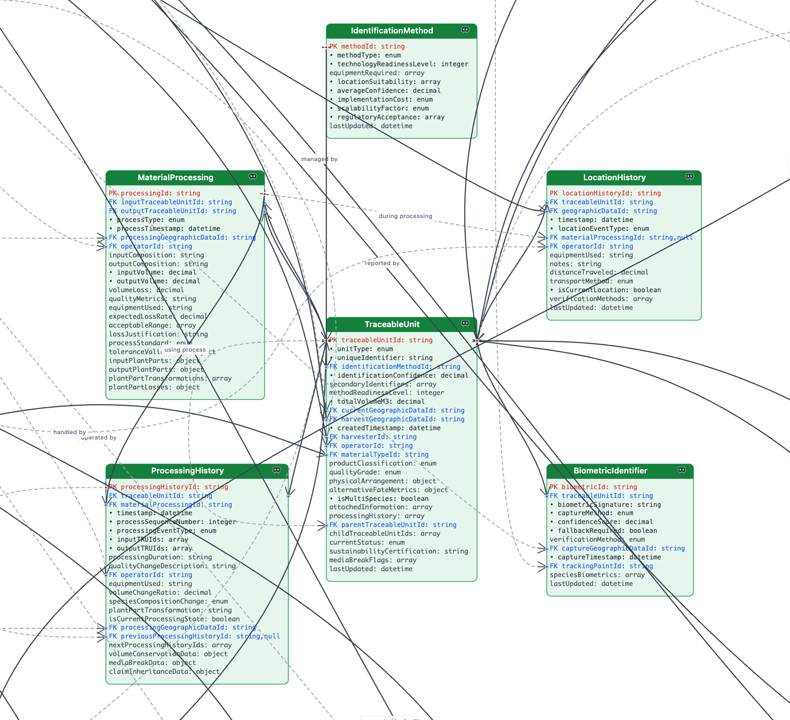
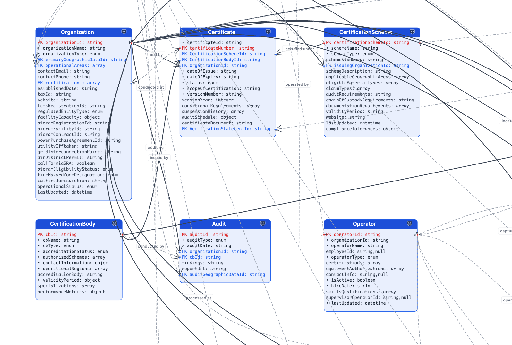
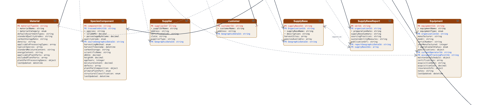
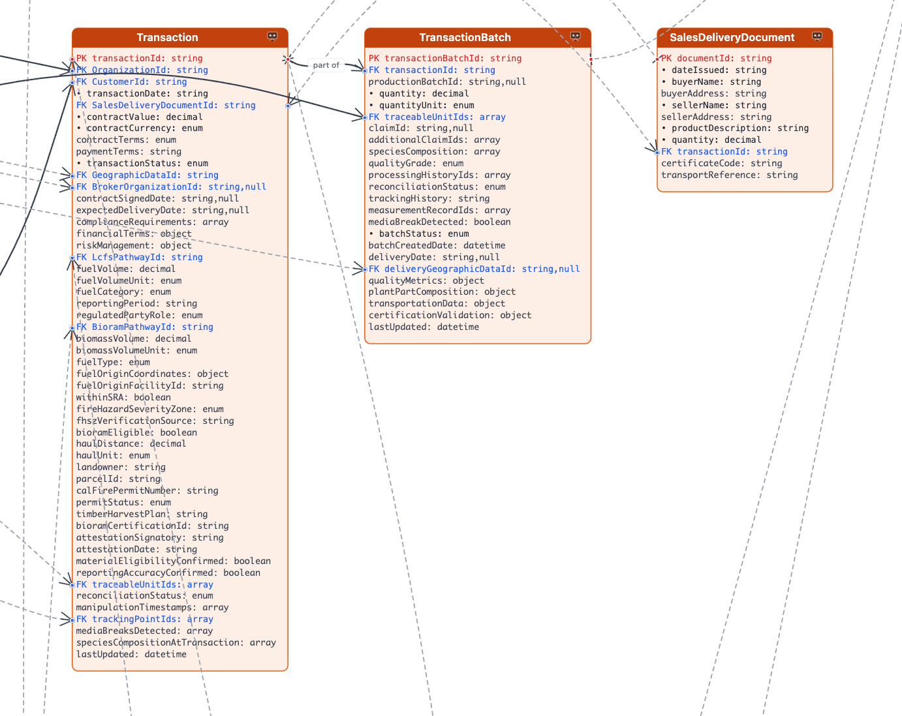
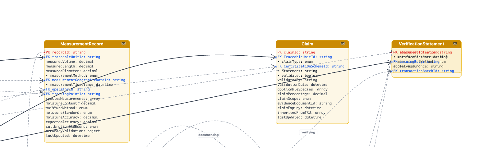
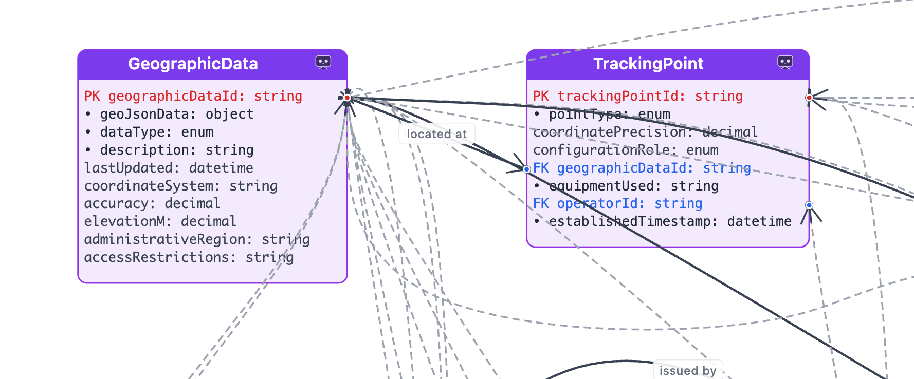
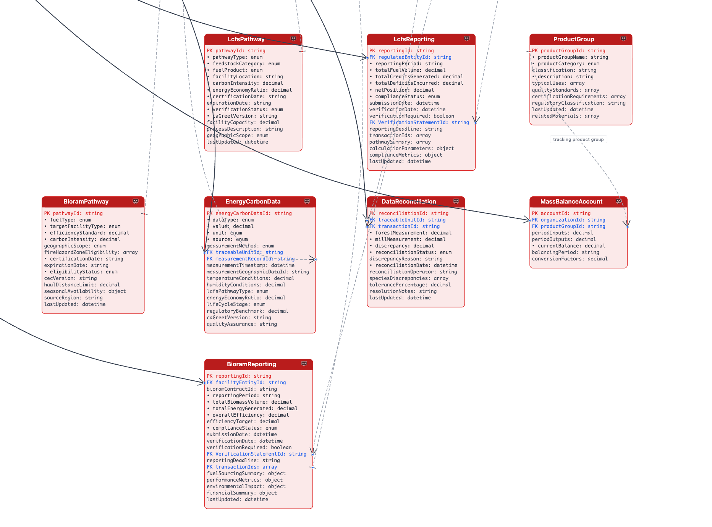
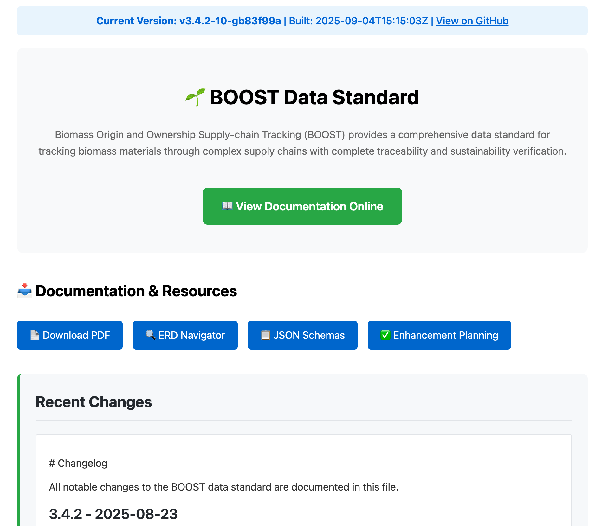

# BOOST v3.4.2 Final Working Group Review

## Agenda Items 2 & 3: Specification Status & Release Components

---

## Agenda Overview

- **Item 2:** Recent Updates Overview (5 min)
- **Item 3:** Critical Release Components Review (20 min)
- Working group consensus building
- Path to formal approval vote

---

# Recent Updates Overview

## Current Version: v3.4.2

**Release Date:** 2025-08-23 
**Title:** Critical Tracking Points and Python Validation Enhancement

--

## Stakeholder Feedback Integration

--

### Issue Resolution Activity (Last 30 Days)

**50+ Issues Closed** across multiple priority levels

**Key Themes Addressed:**
- **Carbon Direct Expert Review Integration:** 6 feedback issues (critical/high priority)
- **Documentation Enhancement:** 15+ PDF/HTML documentation improvements  
- **Schema Validation:** 8+ entity relationship and validation fixes
- **Python Implementation:** Complete validation logic and value demonstration
- **Stakeholder Integration:** Working group attribution and review processes

--

## Key Enhancements Since Last Review

--

### Critical Tracking Points Enhancement (Issue #247)

- **Issue:** *harvest_site and mill_entrance are clear single geographic locations, but skid_road/forest_road is not a single location.*

**TrackingPoint Example:**
```json
{
  "trackingPointId": "TP-MILL-001",
  "pointType": "mill_entrance",
  "geographicDataId": "GEO-MILL-ENTRANCE-Pacific-001",
  "equipmentUsed": "RFID_reader, scale_system, optical_scanner",
  "coordinatePrecision": "±5m",
  "configurationRole": "mandatory"
}
```

**7 Point Types Available:**
`harvest_site`, `consolidation_point`, `mill_entrance`, `transfer_station`, `storage_facility`, `quality_control_point`, `mobile_processing_unit`

--

### Python Reference Implementation (Issue #248)

**Issue:** *The validation logic is what would really be of value here and that's left out*


**Six Validation Categories Now Functional:**
- Schema validation: JSON compliance checking
- Foreign key integrity: Cross-entity relationship validation
- Volume conservation: Material flow consistency with tolerances
- Temporal consistency: Timeline validation across operations
- Business rules: Domain-specific logic enforcement
- Tolerance compliance: Process-specific variance checking


--

### Validation Output Example (Issue #248)
```python
validation_result = {
    "schema_validation": {"status": "PASS", "errors": 0},
    "fk_integrity": {"status": "FAIL", "missing_refs": 2},
    "volume_conservation": {
        "status": "WARNING", 
        "variance": "12.3%",
        "tolerance": "15%",
        "process": "drying"
    },
    "recommendations": [
        "Check MaterialBatch MB-2025-047 foreign key reference",
        "Volume loss within drying tolerance (±15%)"
    ]
}
```

Real error detection with actionable recommendations

Note: Specific domain logic implemented includes: moisture content validation (5-70% reasonable range), species compatibility rules for mixed-species piles, contamination limits checking, volume conservation with process-specific tolerances (transport ±2%, drying ±15%, chipping ±8%, sawmill ±35%), temporal validation for supply chain events, and geographic consistency checking. Framework exists for more sophisticated industry-specific rules as needed.

--

### Physical System Tolerances (Issue #244)

**Issue:** *No physical system will achieve 100% volume/mass conservation... What are the acceptable 'error rates'?*

**Tolerances Now Defined:**
- **Transport operations:** ±2% variance allowance
- **Drying operations:** ±15% volume loss (industry standard)
- **Chipping operations:** ±8% processing loss
- **Sawmill operations:** ±35% lumber production loss
- **De minimis thresholds:** 0.1 m³ minimum tracking levels

--

### Executive Summary Enhancement (Issue #243)

**Issue:** *No basic justification and purpose is stated in standard documentation*

**Resolution Implemented:**
- Added comprehensive overview explaining BOOST's purpose
- Documented TraceableUnit as foundational concept  
- Explained biometric automation value proposition
- Showed regulatory compliance benefits with field combinations
- Justified field inclusion/exclusion decisions

--

### LCFS Credit Integration (Issue #246)

**Issue:** *How has BOOST made LCFS credit claims any easier?*

**Integration Now Documented:**
- Explicit data flow from BOOST tracking to LCFS credits
- Mapped specific BOOST fields to LCFS reporting requirements
- Biomass volume to fuel volume reconciliation process
- Automated report generation examples
- Compliance verification benefits with audit support

--

### Biometric Implementation (Issue #245)

**Issue:** *Very nascent area*

Multiple Options:

- RFID: `RFID-12345-ABC`
- QR Code: `QR-LOG-001-2025`
- Trip Ticket ID: `TT-2025-0823-FOREST-042`
- Biometric: `GRAIN-PATTERN-HASH-XY789` Future technology- Computer vision + photos of wood grain patterns

<div style="font-size: 0.7em;">

Relevant Research: Hwang, 2021: Wood grain identification via machine learning; Ravindran, 2022: USDA forest service end-grain photography; Ergun, 2024: Recent biometric advances in controlled settings

</div>

--

### TraceableUnit Identification Flexibility (Issue #245)
```json
{
  "traceableUnitId": "TRU-LOG-001",
  "uniqueIdentifier": "RFID-12345-ABC",
  "identificationMethodId": "IM-RFID-001",
  "identificationConfidence": 95,
  "secondaryIdentifiers": [
    {
      "identifierType": "qr_code", 
      "identifierValue": "QR-LOG-001-2025",
      "confidence": 90
    },
    {
      "identifierType": "trip_ticket_id",
      "identifierValue": "TT-2025-0823-FOREST-042", 
      "confidence": 75
    },
    {
      "identifierType": "biometric_signature",
      "identifierValue": "GRAIN-PATTERN-HASH-XY789",
      "confidence": 85
    }
  ],
  "methodReadinessLevel": 9
}
```

- **Today:** Use RFID/QR/TT codes
- **Future:** Add biometric signatures as technology matures


---

# Critical Release Components Review

## Schema

--

### Core Traceability Architecture



Note: TraceableUnit-Centric Design with 6 core entities supporting TRU lifecycle, flexible identification methods (trip tickets → biometrics), complete processing chain documentation, and multi-species composition tracking.

--

### Organizational Foundation



Note: Enterprise Integration covering organization and operator management, certificate and audit workflow support, certification body relationships, and comprehensive stakeholder tracking.

--

### Material & Supply Chain



Note: Supply Chain Integration with material type reference system, species component tracking, customer and supplier management, and equipment and supply base coordination.

--

### Transaction Management



Note: Business Process Support including complete transaction lifecycle, batch processing capabilities, sales delivery documentation, and financial and operational integration.

--

### Measurement & Verification



Note: Quality Assurance Framework with multi-point measurement recording, moisture content validation, claim inheritance and verification, and comprehensive audit trails.

--

### Geographic & Tracking



Note: Location Intelligence providing precise coordinate management, tracking point infrastructure, movement history documentation, and geographic compliance verification.

--

### Compliance & Reporting



Note: Regulatory Integration supporting LCFS and BioRAM pathway management, energy carbon data processing, mass balance accounting, and automated report generation.

--

### Technical Validation

**Schema Integrity Status:**
- All entity schemas validated
- Foreign key relationships verified
- ERD alignment confirmed
- Python reference implementation complete

--

## Documentation 



--

### Implementation Resources

**Available for Release:**
- Complete entity schemas (JSON)
- Python reference implementation
- Validation rules and business logic
- Interactive ERD Navigator
- Implementation examples and guidance

--

## Stakeholder Engagement

### California Agencies

- CARB: 3 active working group members (Marieke Fenton, Jeremy Loeb, Carmen Meialua)
- California Department of Conservation: Funding agency with high engagement
- CDFA, CPUC, CalRecycle: Detailed feedback sessions

--

### Industry Stakeholders - Participation Data

**W3C Community Group Members (16 active):**

- **Forest Industry**        Green Diamond, Watershed Research (2 orgs)
- **Regulatory Bodies**      CARB (4 members)
- **Technology Partners**    Carbon Direct (4 members), Veriflux (1)
- **Consulting/Analysis**    Life Cycle Associates, Cascade Resource, Allotrope Partners, Loamist (4 firms)
- **Tribal Enterprise/Economic Development**   Tule River EDC (1 member)

---

## Consensus Building

### Release Readiness Assessment

- **Technical Completeness:** Ready ✓
- **Stakeholder Integration:** Complete ✓
- **Documentation Quality:** Comprehensive ✓
- **Implementation Support:** Available ✓

--

### Working Group Decision Points

1. **Is v3.4.2 technically ready for formal approval?**

2. **Are stakeholder requirements adequately addressed?**

3. **Is documentation complete for public release?**

4. **Should we proceed to formal approval vote today?**

--

### Consensus Framework

**W3C Community Group Procedures:**
- Open discussion of concerns
- Working group consensus assessment
- Formal approval vote (if consensus achieved)
- Documentation of decision and rationale

---

## Next Steps

### If Approval Achieved

1. **Immediate:** GitHub release candidate publication (#57)
2. **This week:** Public mailing list announcement (#59)  
3. **Ongoing:** Implementation support and community engagement
4. **Future:** Working group leadership transition (#68)

--

### If Additional Work Needed

1. **Document specific concerns and requirements**
2. **Assign resolution responsibilities and timelines**
3. **Schedule follow-up review meeting**
4. **Maintain stakeholder communication**

---

## Questions & Discussion

### Open Floor

- Technical clarifications
- Implementation questions  
- Stakeholder concerns
- Release timeline feedback

**Ready to proceed to formal approval vote?**

