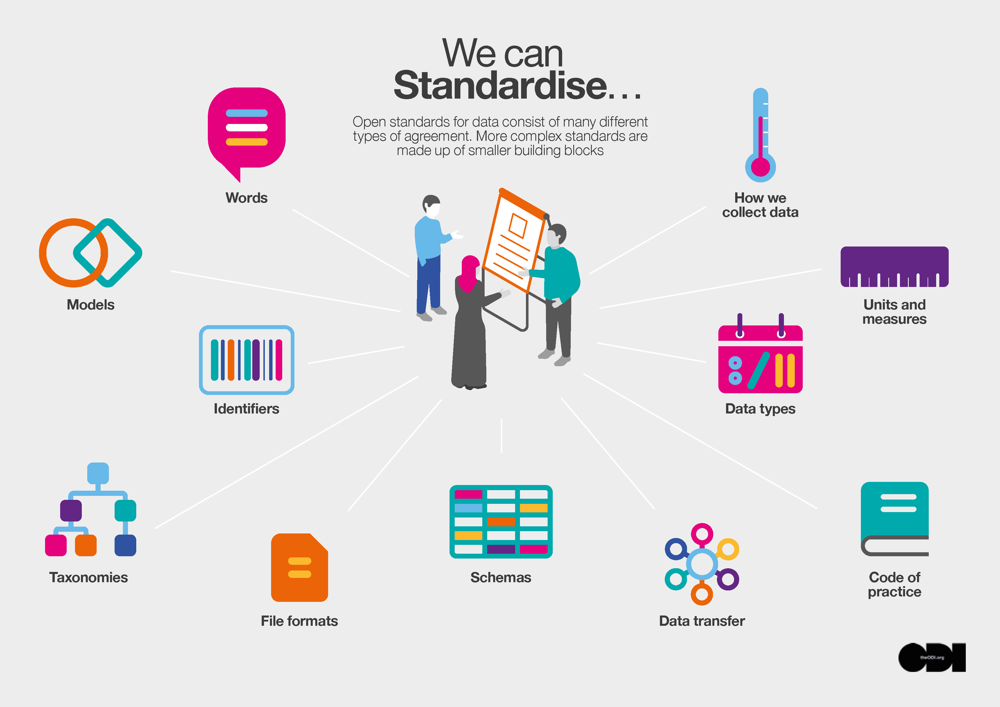

# BOOST + LCFS

---

## Outline

- Review LCFS - Relevant Entities 
- Data Standards: The Foundation for Biomass Chain of Custody
- The Importance of an "Open" Standard
- Relevance of W3C Community Groups

---

--

## What is BOOST?

- W3C Community Group 
- v0.1 funded by California Department of Conservation

--

## What is the objective?

*To develop and maintain a robust interoperable data standard for solid biomass comprised of schemas, protocols, and documenation for tracking biomass materials from source to end-use*

--

## WHAT are the goals

*To improve transparency, verification and trust in biomass supply chains*

*Reduce operational costs and increase access to markets for biomass producers and consumers*

--

## Who is involved?

- Anyone!
- stakeholders:
  - NGOs, independent certification bodies 
  - fed/state agencies, 
  - small and large businesses
  - independent technical experts

---
## Data Standards ??

--
## What are Data Standards?

*Data standards are agreed-upon approaches that allow for consistent measurement, qualification, or exchange of information*

--

## Why develop a Data Standard

Provides a structured framework and a common language for:

- organizing, 
- documenting, 
- formatting **data**
  
Facilitating **aggregation**, **sharing**, and **reuse** across different systems and organizations

--

## What is Chain of Custody (CoC)?

Documentation and recording of:
- movement, 
- handling, 
- transformation 

of material through a supply chain

--

## How do Data Standards Support CoC?

For CoC software, data standards:
  - provide a data framework (entities, attributes, and relationships)
  - provide logic for tracking across complex processes and organizational boundaries
  - enable interoperability between systems
  - provide validation rules

Note: This is a note

---

## OPEN Standards

 
<em>Source: The Open Data Institute</em>

--

## Benefits of Openness

- encourages **interoperability** and digital integration across the supply chain
- transparency and trust among stakeholders in complex supply chains
- democratizes chain of custody data
- software differentiates on performance not on customer coersion

Note:
+ proprietary data formats
+ complex integration
+ data migration obstacles
+ lack of portability

--

## Open Process in Practice

- W3C Community Groups are open to all
- Technical work in the BOOST group is conducted in public, utilizing:
  - Public mail lists 
  - GitHub repositories
  - Google Docs when necessary
- Ensures contributions and decisions are transparently tracked
- Participation does not require W3C CLA but  **we highly encourage it!**

Note:
+ joining the BOOST community group will ensure you are following the development
+ without a membership fee requirement
+ in the spirit of open collaboration

---

