# Sherwood Power Station: BOOST Entity Flow Diagram

## BioRAM Compliance Workflow Using BOOST Data Standard Entities

This diagram illustrates how BOOST entities and attributes are used in a real-world BioRAM compliance scenario for Sherwood Power Station, demonstrating the complete data flow from lignocellulosic biomass feedstocks to CEC reporting.

## Key Metrics from Example
- **Total Q3 Biomass Input**: 4,200 bone dry tonnes
- **Total Energy Output**: 3,360 MWh (12,096 GJ)
- **Power Generation Efficiency**: 36% (exceeding 35% target)
- **Weighted Carbon Intensity**: 16.2 gCO2e/MJ
- **CO2 Performance**: 39% below target (25.0 gCO2e/MJ)
- **Compliance Status**: Compliant (exceeding efficiency and CI targets)

## BioRAM Workflow Diagrams

The complete BioRAM compliance workflow is visualized through three focused diagrams, each demonstrating different aspects of BOOST's data processing capability for biomass power generation:

### 1. Data Flow Through BOOST Entities

This data flow diagram shows how external data sources (biomass supplier records, forestry management data) flow through BOOST entity processing to produce BioRAM regulatory compliance. The visualization demonstrates BOOST's capability to transform diverse biomass supply chain inputs into structured entities and ultimately generate CEC compliance reports. Flow widths and colors indicate data volume and processing stages from forest/mill sources through BOOST entities to final CEC submission.

> **Source:** [feedstock_flow.mermaid](../diagrams/feedstock_flow.mermaid)

### 2. BOOST Entity Relationships (ERD)

This Entity Relationship Diagram shows the complete BOOST data model for BioRAM compliance, including all entity attributes and their relationships with proper cardinality. The ERD demonstrates how BOOST entities are structured to support biomass power generation regulatory requirements while maintaining data integrity across the compliance workflow.

> **Source:** [boost_entity_relationships.mermaid](../diagrams/boost_entity_relationships.mermaid)

### 3. Production Workflow: Transactions → Quarterly Aggregation

This workflow diagram showcases how individual BOOST Transaction entities from multiple biomass suppliers are aggregated into a single BOOST BioRAMReporting entity for quarterly compliance. The diagram demonstrates the BOOST data standard's ability to handle complex biomass procurement aggregation workflows, with four Q3 2025 Transaction entities from different suppliers being consolidated into comprehensive quarterly reporting that meets BioRAM requirements.

> **Source:** [production_workflow.mermaid](../diagrams/production_workflow.mermaid)

## How the Diagrams Connect

These three diagrams provide a focused view of BioRAM compliance using BOOST entities:

1. **Data Flow** - Shows how external biomass supply chain data sources are processed through BOOST entities to generate regulatory compliance, demonstrating the data transformation capability from forest residues to power generation
2. **BOOST Entity Relationships (ERD)** - Provides the technical foundation showing how all entities are structured and connected with proper data modeling for biomass energy operations
3. **Production Workflow** - Demonstrates the operational process of aggregating individual biomass transactions into quarterly BioRAM reporting for regulatory submission

Together, these diagrams illustrate BOOST's comprehensive approach to BioRAM compliance, from raw biomass procurement through entity processing to final regulatory reporting.

## Technical Implementation

The diagrams demonstrate key technical capabilities for biomass power generation:

- **Multi-Supplier Integration**: Forest residues from multiple suppliers (Anderson Mills, Sierra Forest Products, Valley Lumber Co., Mountain Ridge Forestry)
- **Entity Validation**: Structured biomass data processing with validation rules and business logic
- **Regulatory Compliance**: Direct mapping from BOOST entities to BioRAM requirements
- **Audit Trail**: Complete traceability from biomass source through final compliance submission
- **Pathway Management**: Multiple BioRAM pathways (lumber mill residue, forest harvest residue) with different carbon intensities

## Business Impact

This Sherwood Power Station example represents:
- **3,360 MWh** of renewable electricity generated in Q3 2025
- **4,200 bone dry tonnes** of biomass feedstock utilized
- **36% efficiency** exceeding BioRAM minimum requirement of 35%
- **16.2 gCO2e/MJ carbon intensity** significantly below target of 25.0
- **Full compliance** with CEC BioRAM reporting requirements
- **Fire hazard reduction** through utilization of high-risk zone biomass

## Environmental Benefits

The implementation demonstrates significant environmental impact:
- **Wildfire risk reduction** by removing forest residues from high-hazard zones
- **Carbon sequestration** through sustainable biomass utilization
- **Grid stability** through renewable baseload power generation
- **Rural economic development** supporting forest management and lumber operations
- **Waste stream utilization** converting mill residues to valuable energy

## BioRAM Program Context

This example demonstrates compliance with California's Bioenergy Renewable Auction Mechanism:

### Program Requirements Met
- **Feedstock Eligibility**: Lumber mill residues and forest harvest residues (100% qualifying)
- **Efficiency Standards**: 36% electrical efficiency (target: 35% minimum)
- **Carbon Intensity**: 16.2 gCO2e/MJ (target: ≤25.0 gCO2e/MJ)
- **Fire Hazard Zone Priority**: Biomass sourced from high fire-risk areas
- **Quarterly Reporting**: Complete operational data submitted to CEC

### Regulatory Integration
- **Power Purchase Agreement**: 20-year contract with PG&E
- **Renewable Energy Credits**: Eligible for California RPS compliance
- **Air Quality Compliance**: Meets CARB emission standards
- **Forest Management**: Supports CAL FIRE fuel reduction programs

The implementation demonstrates how BOOST entities can support biomass power operations while maintaining regulatory compliance and contributing to California's renewable energy and forest management goals.
