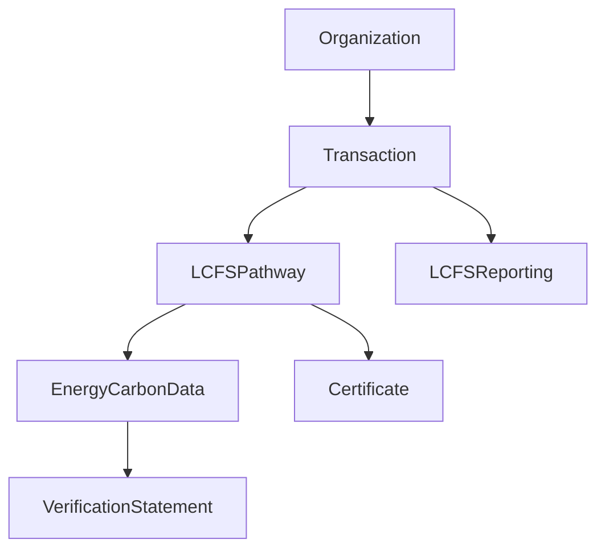

# BOOST Entity Mapping for LCFS Compliance

## Enhanced Entity Framework Based on MECE Analysis

This document provides comprehensive mapping between BOOST entities and California LCFS (Low Carbon Fuel Standard) reporting requirements, ensuring mutually exclusive and collectively exhaustive (MECE) attribute coverage.

---

## Enhanced Core Entities

### 1. EnergyCarbonData Entity - LCFS Enhanced

**LCFS Requirements Addressed:**
- Carbon Intensity (CI) calculations in gCO2e/MJ
- CA-GREET3.0 model compliance
- Energy Economy Ratio (EER) tracking
- Life cycle stage attribution
- Regulatory benchmark comparisons

**Enhanced Attributes:**

| BOOST Attribute       | LCFS Requirement       | Description                 | Example Values                                         |
|-----------------------|------------------------|-----------------------------|--------------------------------------------------------|
| `dataCategory`        | CI Data Classification | Type of carbon/energy data  | "carbon_intensity", "energy_content", "emissions"      |
| `measurementMethod`   | Methodology Tracking   | CA-GREET version and method | "CA-GREET3.0", "GREET2023", "Direct Measurement"       |
| `lcfsPathwayType`     | Pathway Classification | LCFS pathway tier           | "Lookup_Table", "Tier_1", "Tier_2", "Not_LCFS"         |
| `energyEconomyRatio`  | EER Value              | LCFS efficiency multiplier  | 2.5 (for electric vehicles)                            |
| `lifeCycleStage`      | LCA Stage              | Emission source stage       | "feedstock", "production", "transport", "distribution" |
| `regulatoryBenchmark` | CI Benchmark           | Regulatory comparison value | 95.61 (2025 gasoline benchmark)                        |

**LCFS Application Example:**
```json
{
  "energyCarbonDataId": "CI-2025-RD-001",
  "dataCategory": "carbon_intensity",
  "value": 15.2,
  "unit": "gCO2e/MJ",
  "source": "Third-party verification",
  "measurementMethod": "CA-GREET3.0",
  "lcfsPathwayType": "Tier_1",
  "energyEconomyRatio": 1.0,
  "lifeCycleStage": "production",
  "regulatoryBenchmark": 95.61
}
```

### 2. Transaction Entity - LCFS Enhanced

**LCFS Requirements Addressed:**
- Quarterly fuel transaction reporting
- Fuel volume tracking in regulatory units
- Credit/deficit calculation basis
- Regulated party identification
- Pathway attribution

**Enhanced Attributes:**

| BOOST Attribute | LCFS Requirement | Description | Example Values |
|----------------|------------------|-------------|----------------|
| `fuelVolume` | Fuel Quantity | Volume of fuel transacted | 10000.0 |
| `fuelVolumeUnit` | Standardized Units | LCFS-compliant volume units | "gallons", "liters", "GGE" |
| `fuelCategory` | Fuel Type | LCFS fuel classification | "renewable_diesel", "ethanol", "hydrogen" |
| `reportingPeriod` | Quarterly Period | LCFS reporting quarter | "2025-Q1", "2025-Q2" |
| `lcfsPathwayId` | Pathway Reference | Certified pathway used | "CA-RD-2025-001" |
| `regulatedPartyRole` | Entity Role | LCFS regulated party type | "producer", "importer", "blender" |

**LCFS Application Example:**
```json
{
  "transactionId": "TXN-2025-Q1-001",
  "supplyingOrganizationId": "renewable-diesel-producer-001",
  "customerOrganizationId": "fuel-distributor-ca-001",
  "transactionDate": "2025-03-15",
  "fuelVolume": 50000.0,
  "fuelVolumeUnit": "gallons",
  "fuelCategory": "renewable_diesel",
  "reportingPeriod": "2025-Q1",
  "lcfsPathwayId": "CA-RD-2025-001",
  "regulatedPartyRole": "producer"
}
```

### 3. Organization Entity - LCFS Enhanced

**LCFS Requirements Addressed:**
- Regulated entity registration
- Party role identification
- LCFS system integration

**Enhanced Attributes:**

| BOOST Attribute       | LCFS Requirement      | Description                   | Example Values                                   |
|-----------------------|-----------------------|-------------------------------|--------------------------------------------------|
| `lcfsRegistrationId`  | CARB Registration     | LCFS system entity ID         | "LCFS-REG-2025-001"                              |
| `regulatedEntityType` | Entity Classification | LCFS regulated party category | "producer", "importer", "blender", "distributor" |

---

## New LCFS-Specific Entities

### 4. LCFSPathway Entity

**Purpose:** Comprehensive tracking of LCFS-certified fuel pathways

**All Attributes:**

| Attribute            | Type        | Description                    | Example                                  |
|----------------------|-------------|--------------------------------|------------------------------------------|
| `pathwayId`          | string (PK) | Unique LCFS pathway identifier | "CA-RD-2025-001"                         |
| `pathwayType`        | string      | LCFS pathway classification    | "Tier_1", "Tier_2", "Lookup_Table"       |
| `feedstockCategory`  | string      | Biomass feedstock type         | "forest_residue", "agricultural_residue" |
| `fuelProduct`        | string      | End fuel product               | "renewable_diesel", "ethanol", "SAF"     |
| `facilityLocation`   | string      | Production facility location   | "California, USA"                        |
| `carbonIntensity`    | decimal     | Certified CI value             | 15.2                                     |
| `energyEconomyRatio` | decimal     | LCFS efficiency ratio          | 1.0                                      |
| `certificationDate`  | date        | Initial certification date     | "2025-01-15"                             |
| `expirationDate`     | date        | Pathway expiration date        | "2028-01-15"                             |
| `verificationStatus` | string      | Current pathway status         | "active", "suspended", "expired"         |
| `caGreetVersion`     | string      | CA-GREET model version         | "3.0"                                    |

### 5. LCFSReporting Entity

**Purpose:** Quarterly LCFS compliance reporting aggregation

**All Attributes:**

| Attribute               | Type        | Description                    | Example                           |
|-------------------------|-------------|--------------------------------|-----------------------------------|
| `reportingId`           | string (PK) | Unique reporting period ID     | "LCFS-RPT-2025-Q1-001"            |
| `regulatedEntityId`     | string (FK) | Organization submitting report | "renewable-diesel-producer-001"   |
| `reportingPeriod`       | string      | LCFS quarter                   | "2025-Q1"                         |
| `totalFuelVolume`       | decimal     | Total fuel reported (gallons)  | 500000.0                          |
| `totalCreditsGenerated` | decimal     | Credits earned this period     | 25000.0                           |
| `totalDeficitsIncurred` | decimal     | Deficits incurred this period  | 0.0                               |
| `netPosition`           | decimal     | Net credits/deficits           | 25000.0                           |
| `complianceStatus`      | string      | Compliance standing            | "compliant", "deficit", "pending" |
| `submissionDate`        | datetime    | Report submission timestamp    | "2025-04-30T23:59:59Z"            |
| `verificationDate`      | datetime    | Third-party verification date  | "2025-05-15T12:00:00Z"            |

---

## Entity Relationships for LCFS Workflow

### Data Flow Relationships



### Key Relationships

1. **Transaction → LCFSPathway**: Each fuel transaction uses a certified pathway
2. **LCFSPathway → EnergyCarbonData**: Each pathway has carbon intensity data
3. **Organization → LCFSReporting**: Regulated entities submit quarterly reports
4. **LCFSReporting → Transaction**: Reports aggregate multiple transactions
5. **LCFSPathway → Certificate**: Pathways are certified by CARB

---

## LCFS Reporting Workflow

### Quarterly Report Generation Process

1. **Fuel Transaction Capture**
   - Transaction entities record all fuel transfers
   - LCFSPathway entities provide CI values
   - EnergyCarbonData entities supply detailed carbon data

2. **Credit/Deficit Calculation**
   - Compare pathway CI to regulatory benchmark
   - Apply Energy Economy Ratio for alternative fuels
   - Calculate credits (CI below benchmark) or deficits (CI above benchmark)

3. **Quarterly Aggregation**
   - LCFSReporting entity aggregates all transactions for regulated entity
   - Sum total fuel volumes, credits, and deficits
   - Calculate net compliance position

4. **CARB Submission**
   - Generate standardized LCFS report format
   - Submit to CARB LRT-CBTS system
   - Record submission and verification dates

### Credit Calculation Formula

```
Credits = (Benchmark_CI - Pathway_CI) × Fuel_Volume × EER
```

Where:
- Benchmark_CI: Regulatory benchmark (e.g., 95.61 gCO2e/MJ for gasoline in 2025)
- Pathway_CI: Certified pathway carbon intensity
- Fuel_Volume: Volume in energy units (MJ)
- EER: Energy Economy Ratio (pathway-specific)

---

## Validation Rules

### Data Quality Requirements

1. **EnergyCarbonData Validation**
   - CI values must be > 0 and < 1000 gCO2e/MJ
   - EER values must be > 0 and ≤ 10
   - measurementMethod must include CA-GREET version

2. **Transaction Validation**
   - fuelVolume must be > 0
   - reportingPeriod must match current or prior quarter
   - lcfsPathwayId must reference active pathway

3. **LCFSPathway Validation**
   - carbonIntensity must be verified value
   - certificationDate ≤ current date ≤ expirationDate
   - verificationStatus must be "active" for credit generation

4. **Cross-Entity Validation**
   - Transaction date must fall within reportingPeriod
   - Pathway must be certified before transaction date
   - Organization must be LCFS-registered for regulated transactions

This entity framework ensures complete coverage of LCFS requirements while maintaining clear attribute boundaries and preventing data duplication.
