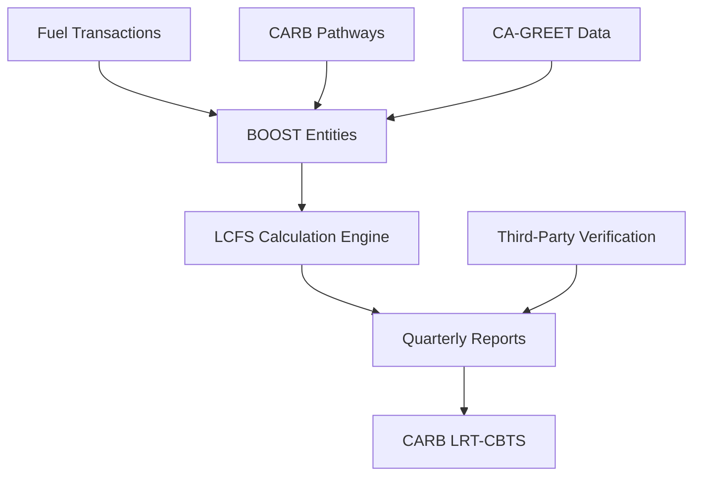
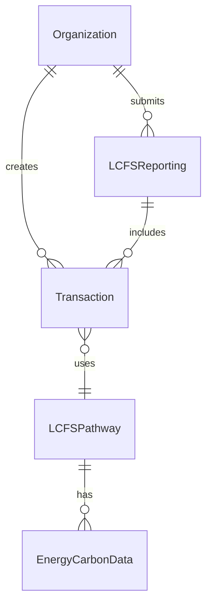

# LCFS Implementation Guide

## BOOST-Powered California Low Carbon Fuel Standard Compliance

This guide provides developers and implementers with a comprehensive overview of how to implement LCFS compliance using the BOOST biomass chain of custody framework.

---

## Overview

The **Low Carbon Fuel Standard (LCFS)** is California's carbon reduction program for transportation fuels. BOOST provides a complete entity framework for LCFS compliance, enabling organizations to:

- Track fuel transactions and pathways
- Calculate LCFS credits and deficits
- Generate quarterly compliance reports
- Submit to CARB's LRT-CBTS system
- Maintain complete audit trails

### Key Benefits

- **Complete Compliance**: Covers all LCFS requirements
- **Entity-Driven**: Structured data model with clear relationships
- **Automated Reporting**: Streamlined quarterly report generation
- **Audit Ready**: Comprehensive documentation and validation
- **CARB Integration**: Direct submission to regulatory systems

---

## Quick Start

### 1. Core Concepts

**LCFS Entities** - BOOST includes 5 key entities for LCFS compliance:
- `Organization` - Regulated parties (producers, importers, blenders)
- `Transaction` - Fuel transfers with volume and pathway data
- `LCFSPathway` - CARB-certified fuel pathways with carbon intensity
- `EnergyCarbonData` - Carbon intensity and CA-GREET data
- `LCFSReporting` - Quarterly compliance reports

**Credit Calculation** - LCFS credits are generated when:
```
Credits = (Benchmark_CI - Pathway_CI) × Fuel_Volume_MJ × EER
```

**Reporting Cycle** - Quarterly reports due 45 days after quarter end

### 2. Implementation Steps

1. **Set Up Entities** - Implement BOOST entities with LCFS enhancements
2. **Register Pathways** - Load CARB-certified pathway data
3. **Track Transactions** - Capture fuel transfers with pathway attribution
4. **Calculate Credits** - Apply LCFS formulas to generate credits/deficits
5. **Generate Reports** - Create quarterly compliance reports
6. **Submit to CARB** - Automated submission to LRT-CBTS system

### 3. Essential Files

| Document                                   | Purpose                  | Key Content                       |
|--------------------------------------------|--------------------------|-----------------------------------|
| `lcfs_workflow_specification.md`           | Complete 5-phase process | Data collection → CARB submission |
| `lcfs_entity_mapping.md`                   | Entity relationships     | Detailed attribute mapping        |
| `lcfs_validation_checklist.md`             | Data quality assurance   | Pre-submission validation         |
| `../../../drafts/images/boost_erd.mermaid` | Data model               | Entity relationship diagram       |

---

## Architecture Overview

### System Architecture



### Data Flow

1. **Input**: Fuel transactions, CARB pathways, carbon intensity data
2. **Processing**: BOOST entities capture and validate data
3. **Calculation**: Credit/deficit calculations using LCFS formulas
4. **Aggregation**: Quarterly summaries by regulated entity
5. **Output**: CARB-compliant reports and submissions

### Entity Relationships



---

## Implementation Phases

### Phase 1: Foundation (Weeks 1-4)
**Goal**: Set up core BOOST entities with LCFS enhancements

**Tasks**:
- Implement enhanced `Organization` entity with LCFS registration
- Create `LCFSPathway` entity for certified pathways
- Set up `EnergyCarbonData` entity for CI tracking
- Establish entity relationships and constraints

**Deliverables**:
- Working data model with LCFS entities
- Entity validation rules
- Basic pathway data loading

### Phase 2: Transaction Processing (Weeks 5-10)
**Goal**: Implement fuel transaction capture and credit calculation

**Tasks**:
- Enhance `Transaction` entity for fuel tracking
- Build LCFS credit calculation engine
- Implement pathway attribution logic
- Create volume conversion utilities

**Deliverables**:
- Transaction processing system
- Credit calculation algorithms
- Pathway matching logic
- Unit conversion framework

### Phase 3: Reporting System (Weeks 11-14)
**Goal**: Build quarterly report generation and aggregation

**Tasks**:
- Create `LCFSReporting` entity
- Build quarterly aggregation logic
- Implement report generation templates
- Add compliance status determination

**Deliverables**:
- Quarterly report generator
- CARB-compliant output format
- Compliance status algorithms
- Report validation system

### Phase 4: CARB Integration (Weeks 15-20)
**Goal**: Integrate with CARB LRT-CBTS system for automated submission

**Tasks**:
- Implement CARB API authentication
- Build report submission workflows
- Add error handling and retry logic
- Create submission status tracking

**Deliverables**:
- CARB API integration
- Automated submission system
- Error handling procedures
- Status monitoring dashboard

### Phase 5: Validation & Production (Weeks 21-22)
**Goal**: Complete testing and deploy production system

**Tasks**:
- Comprehensive validation testing
- Third-party verification support
- Production deployment
- User training and documentation

**Deliverables**:
- Production-ready system
- Validation test results
- User documentation
- Training materials

---

## Key Implementation Details

### Enhanced Entities

#### Organization Entity
```json
{
  "organizationId": "renewable-diesel-producer-001",
  "name": "Green Fuel Manufacturing Corp",
  "lcfsRegistrationId": "LCFS-REG-2025-001",
  "regulatedEntityType": "producer"
}
```

#### Transaction Entity
```json
{
  "transactionId": "TXN-2025-Q1-001",
  "fuelVolume": 50000.0,
  "fuelVolumeUnit": "gallons",
  "fuelCategory": "renewable_diesel",
  "reportingPeriod": "2025-Q1",
  "lcfsPathwayId": "CA-RD-2025-001"
}
```

#### LCFSPathway Entity
```json
{
  "pathwayId": "CA-RD-2025-001",
  "pathwayType": "Tier_1",
  "carbonIntensity": 15.2,
  "energyEconomyRatio": 1.0,
  "verificationStatus": "active"
}
```

### Credit Calculation Implementation

```python
def calculate_lcfs_credits(transaction, pathway, benchmark_ci):
    """Calculate LCFS credits for a fuel transaction"""
    
    # Convert fuel volume to energy units (MJ)
    fuel_volume_mj = convert_to_mj(
        transaction.fuelVolume,
        transaction.fuelVolumeUnit,
        transaction.fuelCategory
    )
    
    # Calculate carbon intensity difference
    ci_difference = benchmark_ci - pathway.carbonIntensity
    
    # Apply Energy Economy Ratio
    eer = pathway.energyEconomyRatio
    
    # Calculate credits (positive) or deficits (negative)
    credits = ci_difference * fuel_volume_mj * eer
    
    return {
        'credits': max(credits, 0),
        'deficits': abs(min(credits, 0)),
        'fuel_volume_mj': fuel_volume_mj
    }
```

### Quarterly Report Structure

```json
{
  "lcfs_quarterly_report": {
    "header": {
      "regulated_entity_id": "LCFS-REG-2025-001",
      "reporting_period": "2025-Q1",
      "submission_date": "2025-04-30T23:59:59Z"
    },
    "summary": {
      "total_fuel_volume_mj": 2500000.0,
      "total_credits_generated": 50000.0,
      "net_position": 50000.0,
      "compliance_status": "compliant"
    },
    "transactions": [...],
    "pathways": [...]
  }
}
```

---

## Integration Points

### CARB Systems
- **LRT-CBTS**: Reporting and tracking system
- **Pathway Database**: Certified pathway lookup
- **Benchmark Values**: Annual regulatory benchmarks

### Third-Party Services
- **Verification**: Approved third-party verifiers
- **CA-GREET**: Carbon intensity modeling
- **Fuel Testing**: Laboratory analysis services

### Internal Systems
- **ERP**: Fuel inventory and transaction data
- **Accounting**: Financial transaction records
- **Quality**: Fuel specifications and testing

---

## Validation Framework

### Pre-Submission Validation

1. **Entity Validation**
   - Required attributes present
   - Data types correct
   - Value ranges appropriate
   - Cross-references valid

2. **Business Logic Validation**
   - Transaction dates within reporting period
   - Pathways active and certified
   - Volume reconciliation complete
   - Credit calculations accurate

3. **Regulatory Compliance**
   - CARB requirements met
   - Documentation complete
   - Verification current
   - Deadlines satisfied

### Validation Checklist Summary

✓ **Organization**: LCFS registration valid and active  
✓ **Transactions**: Complete fuel transfer records  
✓ **Pathways**: CARB-certified and current  
✓ **Carbon Data**: CA-GREET compliant and verified  
✓ **Reports**: Accurate calculations and timely submission  

---

## Development Resources

### Documentation References
- [LCFS Workflow Specification](./lcfs_workflow_specification.md) - Complete process details
- [Entity Mapping Guide](./lcfs_entity_mapping.md) - Detailed attribute specifications
- [Validation Checklist](./lcfs_validation_checklist.md) - Quality assurance procedures

### External Resources
- [CARB LCFS Website](https://ww2.arb.ca.gov/our-work/programs/low-carbon-fuel-standard)
- [LRT-CBTS User Guide](https://www.arb.ca.gov/fuels/lcfs/lrt-cbts/lrt-cbts.htm)
- [CA-GREET Documentation](https://ww2.arb.ca.gov/resources/documents/ca-greet-3-0)

### Support Contacts
- **Technical Support**: BOOST development team
- **Regulatory Questions**: CARB LCFS staff
- **Verification**: Approved third-party verifiers

---

## Success Metrics

### Technical Metrics
- **Report Accuracy**: 99.9% calculation precision
- **Submission Success**: 100% automated submission rate  
- **Processing Time**: <2 hours for quarterly reports
- **Data Completeness**: 100% transaction capture

### Business Metrics
- **Compliance**: Zero regulatory violations
- **Efficiency**: 90% reduction in manual effort
- **Timeliness**: 100% on-time submissions
- **Audit Readiness**: Complete documentation trail

### Getting Started Checklist

- [ ] Review BOOST entity documentation
- [ ] Set up development environment
- [ ] Implement core LCFS entities
- [ ] Load CARB pathway data
- [ ] Build credit calculation engine
- [ ] Create quarterly report generator
- [ ] Test with CARB sandbox system
- [ ] Complete validation checklist
- [ ] Deploy to production

This implementation guide provides the foundation for successful LCFS compliance using BOOST. For detailed technical specifications, refer to the comprehensive workflow and entity mapping documentation.
