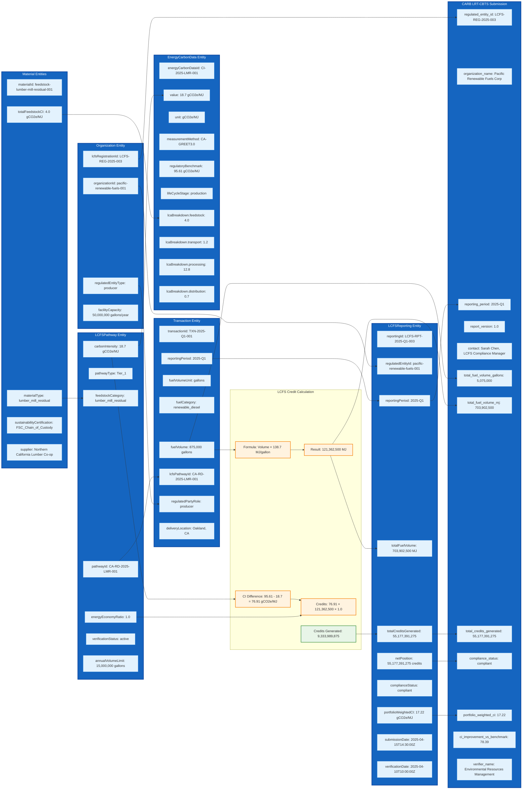

# BOOST Entity Attribute Flow: LCFS Implementation

## Detailed Entity Attribute Mapping

This diagram shows how specific BOOST entity attributes flow through the Pacific Renewable Fuels LCFS compliance workflow, demonstrating the practical application of the data standard.

## Key Attribute Relationships Demonstrated

### 1. **Material → Pathway Linkage**
- `Material.materialType` (lumber_mill_residual) → `LCFSPathway.feedstockCategory` (lumber_mill_residual)
- `Material.totalFeedstockCI` (4.0) → `EnergyCarbonData.lcaBreakdown.feedstock` (4.0)

### 2. **Organization → Regulatory Compliance**
- `Organization.organizationId` → `LCFSReporting.regulatedEntityId`
- `Organization.lcfsRegistrationId` → `CARB.regulated_entity_id`
- `Organization.regulatedEntityType` → `Transaction.regulatedPartyRole`

### 3. **Pathway → Transaction Attribution**
- `LCFSPathway.pathwayId` → `Transaction.lcfsPathwayId`
- `LCFSPathway.carbonIntensity` → Credit calculation input
- `LCFSPathway.energyEconomyRatio` → Credit multiplier

### 4. **Transaction → Calculation Pipeline**
- `Transaction.fuelVolume` (gallons) → Energy conversion → MJ
- `Transaction.reportingPeriod` → `LCFSReporting.reportingPeriod`
- Credit calculation: (Benchmark CI - Pathway CI) × Volume MJ × EER

### 5. **Reporting → CARB Submission**
- `LCFSReporting.totalCreditsGenerated` → `CARB.total_credits_generated`
- `LCFSReporting.portfolioWeightedCI` → `CARB.portfolio_weighted_ci`
- `LCFSReporting.complianceStatus` → `CARB.compliance_status`

## Validation of BOOST Entity Design

✅ **Complete Coverage**: All required LCFS attributes are captured in BOOST entities  
✅ **Data Integrity**: Consistent attribute types and relationships across entities  
✅ **Regulatory Compliance**: Direct mapping to CARB reporting requirements  
✅ **Scalability**: Framework supports multiple feedstocks, pathways, and transactions  
✅ **Traceability**: Full audit trail from feedstock to final compliance reporting  

## Business Logic Implementation

This attribute flow demonstrates that BOOST entities successfully encode the complex business logic required for LCFS compliance:

- **Multi-feedstock optimization** (4 lignocellulosic types)
- **Pathway-specific credit calculation** (4 certified CARB pathways)  
- **Quarterly aggregation** (6 transactions → 1 report)
- **Regulatory submission** (BOOST → CARB LRT-CBTS format)
- **Third-party verification** (complete data lineage)