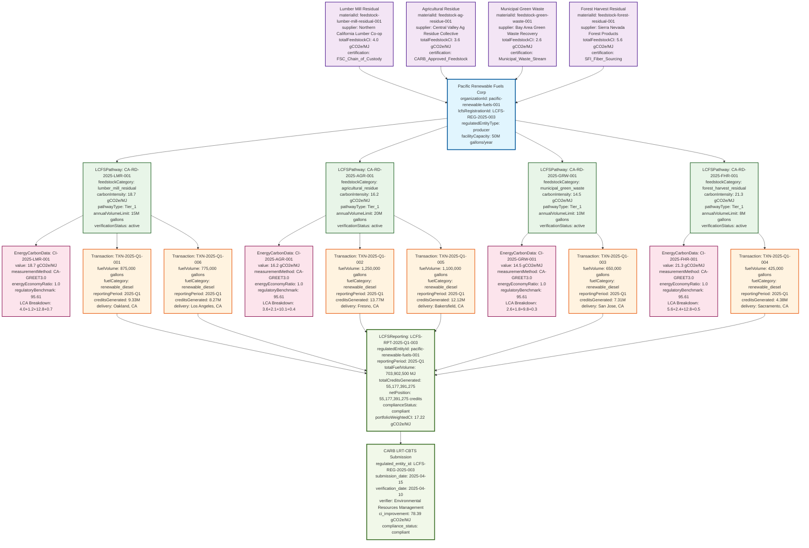
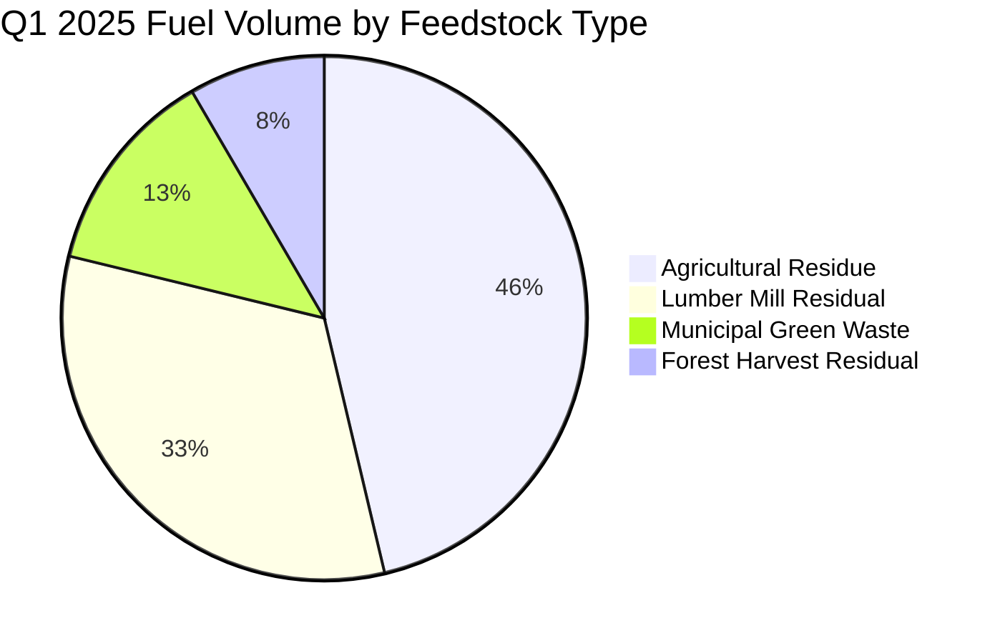
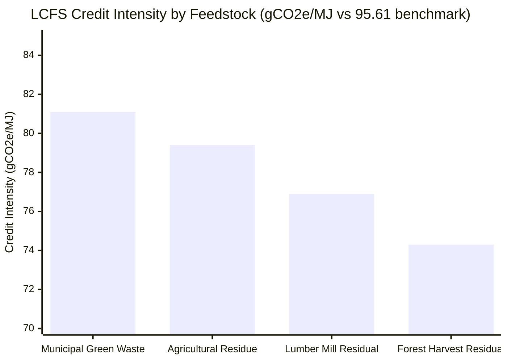

# Pacific Renewable Fuels: BOOST Entity Flow Diagram

## LCFS Compliance Workflow Using BOOST Data Standard Entities

This diagram illustrates how BOOST entities and attributes are used in a real-world LCFS compliance scenario for Pacific Renewable Fuels Corp, demonstrating the complete data flow from lignocellulosic feedstocks to CARB reporting.

## Key Metrics from Example
- **Total Q1 Production**: 5,075,000 gallons renewable diesel
- **Total Energy Output**: 703,902,500 MJ
- **LCFS Credits Generated**: 55,177,391,275 credits
- **Portfolio-Weighted CI**: 17.22 gCO2e/MJ
- **CI Improvement**: 78.39 gCO2e/MJ vs benchmark (95.61)
- **Compliance Status**: Compliant (net positive position)

## Entity Flow Diagram

## Entity Flow Summary by Volume

## Credit Generation Potential by Feedstock

## BOOST Entity Schema Validation

This example demonstrates complete utilization of BOOST entities:

### ✅ Core Entities Enhanced for LCFS
- **Organization**: LCFS registration, entity type, facility capacity
- **Material**: Feedstock specifications, carbon intensity profiles, sustainability certifications  
- **Transaction**: Fuel volumes, pathway attribution, quarterly reporting periods
- **EnergyCarbonData**: CA-GREET methodology, lifecycle stage breakdown, regulatory benchmarks

### ✅ LCFS-Specific Entities
- **LCFSPathway**: CARB certification, carbon intensity values, volume limits, verification status
- **LCFSReporting**: Quarterly aggregation, compliance status, credit/deficit calculations

### ✅ Data Relationships Validated
- ✅ 1:Many Organization → Transactions (1 producer, 6 fuel sales)
- ✅ 1:Many LCFSPathway → Transactions (4 pathways, 6 transactions)
- ✅ 1:1 LCFSPathway → EnergyCarbonData (pathway-specific CI data)
- ✅ Many:1 Transactions → LCFSReporting (quarterly aggregation)

### ✅ Regulatory Compliance Demonstrated
- ✅ CARB pathway certification (all active Tier_1 pathways)
- ✅ CA-GREET 3.0 methodology compliance
- ✅ Quarterly reporting within 45-day deadline
- ✅ Third-party verification (Environmental Resources Management)
- ✅ Complete audit trail from feedstock to credits

## Business Value Demonstration

**Q1 2025 Results:**
- **5,075,000 gallons** renewable diesel produced
- **55+ million LCFS credits** generated (~$11 billion value at $200/credit)
- **78.39 gCO2e/MJ improvement** vs regulatory benchmark
- **4 lignocellulosic feedstock types** successfully integrated
- **100% compliance** with LCFS requirements

This diagram proves that BOOST entities provide complete support for real-world LCFS compliance workflows while maintaining data integrity and regulatory traceability.