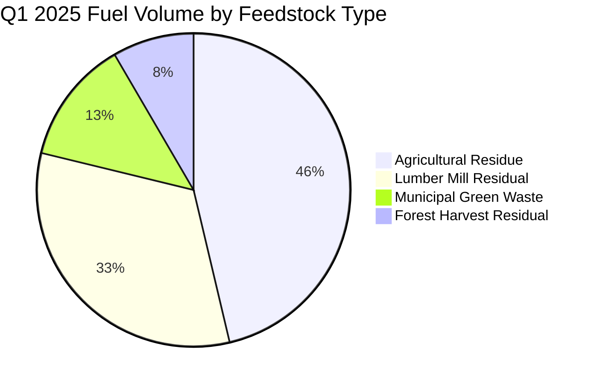
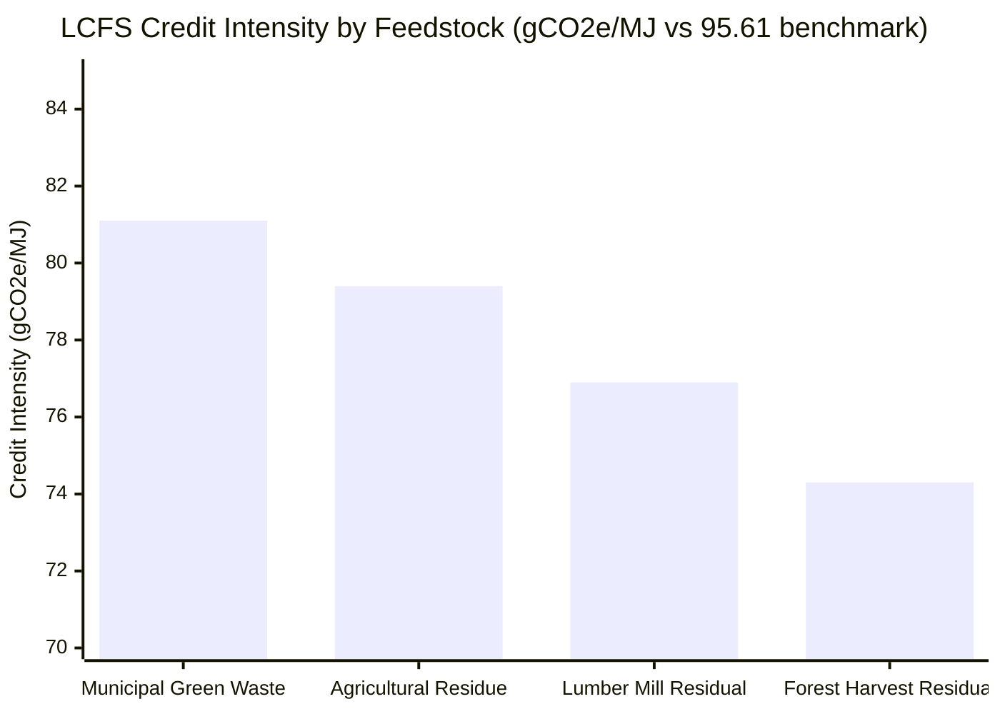

# Pacific Renewable Fuels: BOOST Entity Flow Diagram

## LCFS Compliance Workflow Using BOOST Data Standard Entities

This diagram illustrates how BOOST entities and attributes are used in a real-world LCFS compliance scenario for Pacific Renewable Fuels Corp, demonstrating the complete data flow from lignocellulosic feedstocks to CARB reporting.

## Key Metrics from Example
- **Total Q1 Production**: 5,075,000 gallons renewable diesel
- **Total Energy Output**: 703,902,500 MJ
- **LCFS Credits Generated**: 55,177,391,275 credits
- **Portfolio-Weighted CI**: 17.22 gCO2e/MJ
- **CI Improvement**: 78.39 gCO2e/MJ vs benchmark (95.61)
- **Compliance Status**: Compliant (net positive position)

## LCFS Workflow Diagrams

The complete LCFS compliance workflow is visualized through three focused diagrams, each demonstrating different aspects of BOOST's data processing capability:

### 1. Data Flow Through BOOST Entities

This data flow diagram shows how external data sources (4.2M+ records) flow through BOOST entity processing to produce regulatory compliance. The visualization demonstrates BOOST's capability to transform diverse data inputs into structured entities and ultimately generate LCFS compliance reports. Flow widths and colors indicate data volume and processing stages from source systems through BOOST entities to final CARB submission.

> **Source:** [feedstock_flow.mermaid](diagrams/feedstock_flow.mermaid)

### 2. BOOST Entity Relationships (ERD)

This Entity Relationship Diagram shows the complete BOOST data model for LCFS compliance, including all entity attributes and their relationships with proper cardinality. The ERD demonstrates how BOOST entities are structured to support regulatory requirements while maintaining data integrity across the compliance workflow.

> **Source:** [boost_entity_relationships.mermaid](diagrams/boost_entity_relationships.mermaid)

### 3. Production Workflow: Transactions → Quarterly Aggregation

This workflow diagram showcases how individual BOOST Transaction entities are aggregated into a single BOOST LCFSReporting entity for quarterly compliance. The diagram demonstrates the BOOST data standard's ability to handle complex transaction aggregation workflows, with six Q1 2025 Transaction entities across different California delivery points being consolidated into comprehensive quarterly reporting that meets LCFS requirements.

> **Source:** [production_workflow.mermaid](diagrams/production_workflow.mermaid)

## How the Diagrams Connect

These three diagrams provide a focused view of LCFS compliance using BOOST entities:

1. **Data Flow** - Shows how external data sources are processed through BOOST entities to generate regulatory compliance, demonstrating the data transformation capability
2. **BOOST Entity Relationships (ERD)** - Provides the technical foundation showing how all entities are structured and connected with proper data modeling
3. **Production Workflow** - Demonstrates the operational process of aggregating individual transactions into quarterly reporting for regulatory submission

Together, they demonstrate BOOST's comprehensive capability to support LCFS compliance across data processing, technical architecture, and operational workflows.

## Entity Flow Summary by Volume

## Credit Generation Potential by Feedstock

## BOOST Entity Schema Validation

This example demonstrates complete utilization of BOOST entities:

### ✅ Core Entities Enhanced for LCFS
- **Organization**: LCFS registration, entity type, facility capacity
- **Material**: Feedstock specifications, carbon intensity profiles, sustainability certifications  
- **Transaction**: Fuel volumes, pathway attribution, quarterly reporting periods
- **EnergyCarbonData**: CA-GREET methodology, lifecycle stage breakdown, regulatory benchmarks

### ✅ LCFS-Specific Entities
- **LCFSPathway**: CARB certification, carbon intensity values, volume limits, verification status
- **LCFSReporting**: Quarterly aggregation, compliance status, credit/deficit calculations

### ✅ Data Relationships Validated
- ✅ 1:Many Organization → Transactions (1 producer, 6 fuel sales)
- ✅ 1:Many LCFSPathway → Transactions (4 pathways, 6 transactions)
- ✅ 1:1 LCFSPathway → EnergyCarbonData (pathway-specific CI data)
- ✅ Many:1 Transactions → LCFSReporting (quarterly aggregation)

### ✅ Regulatory Compliance Demonstrated
- ✅ CARB pathway certification (all active Tier_1 pathways)
- ✅ CA-GREET 3.0 methodology compliance
- ✅ Quarterly reporting within 45-day deadline
- ✅ Third-party verification (Environmental Resources Management)
- ✅ Complete audit trail from feedstock to credits

## Business Value Demonstration

**Q1 2025 Results:**
- **5,075,000 gallons** renewable diesel produced
- **55+ million LCFS credits** generated (~$11 billion value at $200/credit)
- **78.39 gCO2e/MJ improvement** vs regulatory benchmark
- **4 lignocellulosic feedstock types** successfully integrated
- **100% compliance** with LCFS requirements

This diagram proves that BOOST entities provide complete support for real-world LCFS compliance workflows while maintaining data integrity and regulatory traceability.