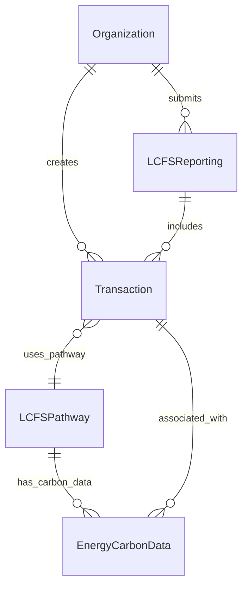

# LCFS Entity Specification
## BOOST Entity Framework for California Low Carbon Fuel Standard

This specification defines the BOOST entity extensions and data structures needed to support California's Low Carbon Fuel Standard (LCFS) regulatory compliance.

---

## Overview

The **Low Carbon Fuel Standard (LCFS)** is California's carbon reduction program for transportation fuels, administered by the California Air Resources Board (CARB). This specification shows how BOOST entities can be extended to support LCFS compliance requirements:

- Enhanced entities for fuel transaction tracking with pathway attribution
- Credit calculation framework using carbon intensity data
- Quarterly reporting data structures for CARB submission
- Complete audit trail maintenance through entity relationships
- Integration with existing biomass supply chain traceability

### LCFS Regulatory Requirements
- **Reporting Frequency**: Quarterly submissions to CARB
- **Data Requirements**: Complete transaction coverage with pathway attribution
- **Calculation Method**: CARB-specified credit formulas using CA-GREET methodology
- **Verification**: Third-party verification required for large regulated entities

---

## Core LCFS Entities

### 1. Enhanced Organization Entity

**LCFS Enhancements:**
```json
{
  "organizationId": "string",
  "name": "string", 
  "lcfsRegistrationId": "string",
  "regulatedEntityType": "producer|importer|blender|distributor"
}
```

### 2. Enhanced Transaction Entity

**LCFS Enhancements:**
```json
{
  "transactionId": "string",
  "fuelVolume": "decimal",
  "fuelVolumeUnit": "gallons|liters|GGE",
  "fuelCategory": "gasoline|diesel|renewable_diesel|ethanol|hydrogen",
  "reportingPeriod": "YYYY-QN",
  "lcfsPathwayId": "string",
  "regulatedPartyRole": "producer|importer|blender|distributor"
}
```

### 3. LCFSPathway Entity

```json
{
  "pathwayId": "string",
  "pathwayType": "Lookup_Table|Tier_1|Tier_2",
  "feedstockCategory": "corn|sugarcane|forest_residue|agricultural_residue",
  "fuelProduct": "ethanol|renewable_diesel|sustainable_aviation_fuel",
  "facilityLocation": "string",
  "carbonIntensity": "decimal (gCO2e/MJ)",
  "energyEconomyRatio": "decimal",
  "certificationDate": "date",
  "expirationDate": "date",
  "verificationStatus": "active|suspended|expired",
  "caGreetVersion": "string"
}
```

### 4. Enhanced EnergyCarbonData Entity

**LCFS Enhancements:**
```json
{
  "energyCarbonDataId": "string",
  "dataCategory": "carbon_intensity|energy_content|emissions",
  "value": "decimal",
  "unit": "gCO2e/MJ|MJ/kg|etc",
  "measurementMethod": "CA-GREET3.0|GREET2023|Direct_Measurement",
  "lcfsPathwayType": "Lookup_Table|Tier_1|Tier_2|Not_LCFS",
  "energyEconomyRatio": "decimal",
  "lifeCycleStage": "feedstock|production|transport|distribution|combustion",
  "regulatoryBenchmark": "decimal"
}
```

### 5. LCFSReporting Entity

```json
{
  "reportingId": "string",
  "regulatedEntityId": "string",
  "reportingPeriod": "YYYY-QN",
  "totalFuelVolume": "decimal",
  "totalCreditsGenerated": "decimal",
  "totalDeficitsIncurred": "decimal",
  "netPosition": "decimal",
  "complianceStatus": "compliant|deficit|pending",
  "submissionDate": "datetime",
  "verificationDate": "datetime"
}
```

---

## Credit Calculation Formula

LCFS credits are calculated using the formula:

```
Credits = (Benchmark_CI - Pathway_CI) × Fuel_Volume_MJ × EER
```

**Where:**
- **Benchmark_CI**: Annual regulatory benchmark (gCO2e/MJ)
- **Pathway_CI**: Certified pathway carbon intensity
- **Fuel_Volume_MJ**: Fuel volume converted to megajoules
- **EER**: Energy Economy Ratio (efficiency multiplier)

**Volume Conversion Factors:**
- Renewable Diesel: 138.7 MJ/gallon
- Ethanol: 84.5 MJ/gallon
- Gasoline: 120.0 MJ/gallon
- Diesel: 138.7 MJ/gallon

**Regulatory Benchmarks (2025):**
- Gasoline: 95.61 gCO2e/MJ
- Diesel: 98.47 gCO2e/MJ

---

## LCFS Compliance Workflow

### Quarterly Reporting Process

**Data Flow:**
1. **Transaction Capture** - BOOST Transaction entities capture fuel transfers with LCFS pathway attribution
2. **Credit Calculation** - Apply CARB formulas using carbon intensity and volume data
3. **Quarterly Aggregation** - Sum transactions by organization and fuel type
4. **Report Generation** - Create CARB-compliant quarterly submissions
5. **Verification** - Third-party verification for large entities

**Calculation Logic:**
```python
# LCFS Credit Calculation
credits = (benchmark_ci - pathway_ci) * fuel_volume_mj * energy_economy_ratio
```

**Example Workflow:**
```json
{
  "transaction": {
    "fuelVolume": 875000.0,
    "fuelCategory": "renewable_diesel",
    "lcfsPathwayId": "CA-RD-2025-LMR-001"
  },
  "pathway": {
    "carbonIntensity": 19.85,
    "energyEconomyRatio": 1.0
  },
  "calculation": {
    "volumeMJ": 121362500.0,
    "creditsGenerated": 9543945.25
  }
}
```

---

## Entity Relationships



---

## Validation Requirements

### Data Quality Checks
- All required entity attributes must be present
- Fuel volumes must be positive numbers
- Pathway IDs must reference active CARB pathways
- Reporting periods must follow YYYY-QN format
- Carbon intensity values must be within reasonable ranges

### Business Logic Validation
- Transactions must fall within reporting period
- Organizations must have valid LCFS registration
- Pathways must not be expired or suspended
- Credit calculations must reconcile with manual verification

### Regulatory Compliance
- Reports must be submitted within 45-day deadline
- Large entities must obtain third-party verification
- All supporting documentation must be retained for audit
- Pathway certification must be current and valid

---

## Data Requirements

### Entity Validation Rules
- All LCFS-enhanced entities must include required regulatory attributes
- Fuel volumes must be positive numbers with valid units
- Pathway IDs must reference active CARB-certified pathways
- Reporting periods must follow YYYY-QN format
- Carbon intensity values must be within CARB-approved ranges

### Regulatory Compliance
- Organizations must have valid LCFS registration with CARB
- Fuel pathways must be CARB-certified and not expired
- Transaction dates must fall within correct reporting period
- Credit calculations must use CARB-approved conversion factors
- Reports must be submitted within regulatory deadlines

---

## References

### CARB Resources
- **LCFS Program**: https://ww2.arb.ca.gov/our-work/programs/low-carbon-fuel-standard
- **LRT-CBTS System**: https://www.arb.ca.gov/fuels/lcfs/lrt-cbts/lrt-cbts.htm
- **CA-GREET Model**: https://ww2.arb.ca.gov/resources/documents/ca-greet-3-0

### BOOST Framework
- **Core Entities**: See main repository ERD documentation
- **Entity Relationships**: Refer to BOOST entity specifications
- **Validation Standards**: Review BOOST data validation requirements