# Pacific Renewable Fuels: BOOST Entity Flow Diagram

## LCFS Compliance Workflow Using BOOST Data Standard Entities

This diagram illustrates how BOOST entities and attributes are used in a real-world LCFS compliance scenario for Pacific Renewable Fuels Corp, demonstrating the complete data flow from lignocellulosic feedstocks to CARB reporting.

## Key Metrics from Example
- **Total Q1 Production**: 5,075,000 gallons renewable diesel
- **Total Energy Output**: 703,902,500 MJ
- **LCFS Credits Generated**: 55,177,391,275 credits
- **Portfolio-Weighted CI**: 17.22 gCO2e/MJ
- **CI Improvement**: 78.39 gCO2e/MJ vs benchmark (95.61)
- **Compliance Status**: Compliant (net positive position)

## LCFS Workflow Diagrams

The complete LCFS compliance workflow is visualized through three focused diagrams, each demonstrating different aspects of BOOST's data processing capability:

### 1. Data Flow Through BOOST Entities

This data flow diagram shows how external data sources (4.2M+ records) flow through BOOST entity processing to produce regulatory compliance. The visualization demonstrates BOOST's capability to transform diverse data inputs into structured entities and ultimately generate LCFS compliance reports. Flow widths and colors indicate data volume and processing stages from source systems through BOOST entities to final CARB submission.

> **Source:** [feedstock_flow.mermaid](../diagrams/feedstock_flow.mermaid)

### 2. BOOST Entity Relationships (ERD)

This Entity Relationship Diagram shows the complete BOOST data model for LCFS compliance, including all entity attributes and their relationships with proper cardinality. The ERD demonstrates how BOOST entities are structured to support regulatory requirements while maintaining data integrity across the compliance workflow.

> **Source:** [boost_entity_relationships.mermaid](../diagrams/boost_entity_relationships.mermaid)

### 3. Production Workflow: Transactions → Quarterly Aggregation

This workflow diagram showcases how individual BOOST Transaction entities are aggregated into a single BOOST LCFSReporting entity for quarterly compliance. The diagram demonstrates the BOOST data standard's ability to handle complex transaction aggregation workflows, with six Q1 2025 Transaction entities across different California delivery points being consolidated into comprehensive quarterly reporting that meets LCFS requirements.

> **Source:** [production_workflow.mermaid](../diagrams/production_workflow.mermaid)

## How the Diagrams Connect

These three diagrams provide a focused view of LCFS compliance using BOOST entities:

1. **Data Flow** - Shows how external data sources are processed through BOOST entities to generate regulatory compliance, demonstrating the data transformation capability
2. **BOOST Entity Relationships (ERD)** - Provides the technical foundation showing how all entities are structured and connected with proper data modeling
3. **Production Workflow** - Demonstrates the operational process of aggregating individual transactions into quarterly reporting for regulatory submission

Together, these diagrams illustrate BOOST's comprehensive approach to LCFS compliance, from raw data ingestion through entity processing to final regulatory reporting.

## Technical Implementation

The diagrams demonstrate key technical capabilities:

- **Multi-Source Data Integration**: 4.2M feedstock records, 1.8M CARB pathway records, 2.1M production records
- **Entity Validation**: Structured data processing with validation rules and business logic
- **Regulatory Compliance**: Direct mapping from BOOST entities to LCFS requirements
- **Audit Trail**: Complete traceability from source data through final compliance submission

## Business Impact

This Pacific Renewable Fuels example represents:
- **55.2 billion LCFS credits** generated in Q1 2025
- **$109+ million estimated value** based on current credit pricing
- **78.39 gCO2e/MJ improvement** over regulatory benchmarks
- **Full compliance** with CARB reporting requirements

The implementation demonstrates how BOOST entities can support large-scale renewable fuel operations while maintaining regulatory compliance and audit integrity.